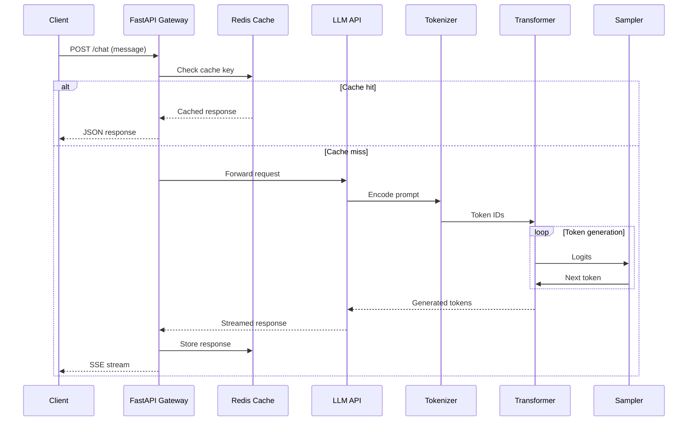

# What an LLM Actually Is (and Isn't)

## Introduction

Every few years our industry stumbles onto a technology that gets treated less like software and more like sorcery. Large Language Models are the current victim. Walk into any engineering standup and you'll hear phrases like "the model thinks..." or "the LLM knows..." as if we're managing an intern with a photographic memory instead of a statistical function approximator with a token budget.

Here's what an LLM actually is: a giant conditional probability distribution over a finite vocabulary, learned by gradient descent on a massive corpus, and exposed through a text-generation loop. That's it. There's no reasoning engine inside, no database of facts, no understanding of truth. There is a mathematical function that maps a sequence of tokens to a probability distribution over the next token, applied recursively.

This article is about what changes when you internalize that definition, and what breaks when you don't.

## Why This Matters

We're seeing production web services built on top of LLM APIs at a pace that should worry anyone who has debugged a distributed system at 3 AM. The fundamental problem is that LLMs are being architected into systems as if they were a more flexible version of a database or a search engine. They are not. They are nondeterministic, stateful only within a bounded context window, and expensive to run at scale.

Consider what happens in a typical web app today:

1. A user submits a request through a browser.
2. Your backend forwards that request to an LLM API.
3. The API returns a generated string.
4. You parse that string and use it to control business logic.

If that generated string is malformed, your entire request path breaks. If the model hallucinates a field that doesn't exist in your schema, your validation layer rejects it. If two users hit the same expensive endpoint, you pay for the same tokens twice.

Understanding the underlying mechanism — tokenization, attention, sampling, context windows — gives you the tools to design around these failure modes. It tells you when to use an LLM, when to use a regex, and when to use a lookup table. It tells you why your streaming latency is what it is, and why your memory usage grows quadratically with sequence length.

## How It Works

Let's walk through the full inference pipeline, from raw text to generated output. This is the mental model you need when you're debugging a production issue.

### Step 1: Tokenization

The model doesn't see characters. It sees tokens — subword units from a learned vocabulary. The string `"unbelievable"` might become `["un", "belie", "vable"]`. The tokenizer is a fixed, trained component. It has no notion of correctness; it simply maps bytes to integer IDs deterministically.

### Step 2: Embedding

Each token ID is mapped to a dense vector via an embedding lookup table. This table is learned during training. The vector captures semantic and syntactic properties of the token in high-dimensional space.

### Step 3: Transformer Blocks

The embedded vectors pass through a stack of transformer blocks. Each block contains:

- **Multi-head self-attention**: Computes a weighted sum of the token representations from the entire context window. This is where the model learns which tokens matter for predicting the next one.
- **Feed-forward network**: A two-layer MLP applied independently to each token position, adding nonlinearity and representational capacity.
- **Layer normalization and residual connections**: Stabilize training and enable deep stacks.

### Step 4: Next-Token Prediction

The output of the final block is projected through a linear layer to produce a logit for every token in the vocabulary. A softmax converts these logits into a probability distribution. The model then samples from that distribution (or takes the argmax, depending on the sampling strategy).

### Step 5: Autoregressive Loop

The sampled token is appended to the input sequence, and the entire process repeats. This is the loop that generates text, one token at a time.



The critical takeaway: the model has no external memory. Everything it "knows" is either encoded in its weights (learned during training) or present in the current context window. There is no background process fetching facts. There is no verification step. There is only the next-token probability distribution.

## Core Concepts

### Tokens and Context Windows

A token is roughly 3-4 characters of English text, though it varies by language and script. The context window is the maximum number of tokens the model can attend to in a single forward pass. This is a hard hardware limit, not a design choice. Every token in the context attends to every other token, so the memory footprint of attention grows as O(n²).

### Parameters and Weights

Parameters are the learned numbers inside the transformer — the embedding matrix, the attention projections, the feed-forward weights. A 7B model has 7 billion of them. The model's "knowledge" is distributed across these weights in a way we don't fully understand and can't easily inspect. This is the source of both its power and its opacity.

### Temperature and Top-p

These control the sampling distribution. Temperature scales the logits before softmax. Lower temperatures make the distribution sharper (more deterministic); higher temperatures make it flatter (more diverse). Top-p truncates the distribution to the smallest set of tokens whose cumulative probability exceeds p. Both are tools for controlling the trade-off between coherence and creativity.

### The KV Cache

During generation, the model recomputes attention for every new token. To avoid recomputing the key and value vectors for all previous tokens, production inference servers cache them. This is called the KV cache. It grows linearly with sequence length and batch size, which is why long conversations consume memory fast.

## Examples & Code Walkthrough

Let's build a production-grade web service that uses an LLM API responsibly. This is a FastAPI endpoint that accepts a user message, streams the LLM response back to the browser, and validates the output against a schema.

```python
import asyncio
import json
import time
from typing import AsyncGenerator, Dict, List, Optional

import httpx
from fastapi import FastAPI, HTTPException, Request
from fastapi.responses import StreamingResponse
from pydantic import BaseModel, Field, ValidationError

app = FastAPI()

# --- Domain Models ---

class ChatRequest(BaseModel):
    message: str
    session_id: Optional[str] = None
    max_tokens: int = 512

class ChatResponse(BaseModel):
    content: str
    finish_reason: str
    usage: Dict[str, int]

# --- LLM Client with retry and streaming ---

class LLMClient:
    """
    Minimal HTTP client for an OpenAI-compatible chat completions endpoint.
    Handles retries with exponential backoff and streams responses.
    """
    def __init__(self, base_url: str, api_key: str):
        self.base_url = base_url.rstrip("/")
        self.api_key = api_key
        self._client = httpx.AsyncClient(
            base_url=self.base_url,
            headers={"Authorization": f"Bearer {self.api_key}"},
            timeout=httpx.Timeout(connect=10.0, read=60.0, write=10.0, pool=10.0),
        )

    async def stream_chat(
        self,
        messages: List[Dict[str, str]],
        max_tokens: int = 512,
        temperature: float = 0.2,
    ) -> AsyncGenerator[str, None]:
        """
        Streams the LLM response token by token.
        Raises on non-retryable errors after exhausting retries.
        """
        payload = {
            "model": "gpt-4o-mini",  # replace with your model
            "messages": messages,
            "max_tokens": max_tokens,
            "temperature": temperature,
            "stream": True,
        }

        max_retries = 3
        backoff_base = 0.5

        for attempt in range(max_retries):
            try:
                async with self._client.stream(
                    "POST", "/v1/chat/completions", json=payload
                ) as response:
                    if response.status_code == 429:
                        # Rate limited — retry with exponential backoff
                        await asyncio.sleep(backoff_base * (2**attempt))
                        continue

                    if response.status_code >= 500:
                        # Server error — retry
                        await asyncio.sleep(backoff_base * (2**attempt))
                        continue

                    if response.status_code != 200:
                        body = await response.aread()
                        raise RuntimeError(
                            f"LLM API error {response.status_code}: {body.decode()}"
                        )

                    # Parse Server-Sent Events
                    async for line in response.aiter_lines():
                        if not line.startswith("data:"):
                            continue
                        data = line[5:].strip()
                        if data == "[DONE]":
                            return
                        try:
                            chunk = json.loads(data)
                        except json.JSONDecodeError:
                            continue

                        delta = chunk.get("choices", [{}])[0].get("delta", {})
                        token = delta.get("content")
                        if token:
                            yield token

                    return  # Success

            except httpx.TransportError as exc:
                if attempt == max_retries - 1:
                    raise
                await asyncio.sleep(backoff_base * (2**attempt))

        raise RuntimeError("Failed to get a response from the LLM after retries")

# --- Cache layer (in-memory for demo; use Redis in production) ---

class TTLCache:
    def __init__(self, ttl_seconds: int = 3600):
        self._store: Dict[str, tuple[str, float]] = {}
        self._ttl = ttl_seconds

    def get(self, key: str) -> Optional[str]:
        if key not in self._store:
            return None
        value, expires_at = self._store[key]
        if time.monotonic() > expires_at:
            del self._store[key]
            return None
        return value

    def set(self, key: str, value: str) -> None:
        self._store[key] = (value, time.monotonic() + self._ttl)
