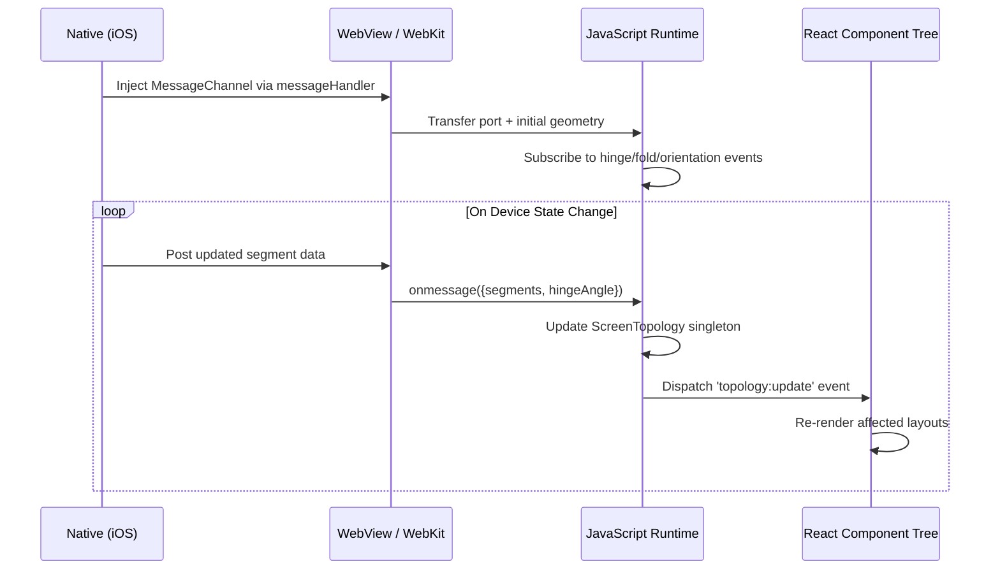

# What iOS Developers Need to Change in their Apps to prepare for the iPhone Duo

## Introduction
The iPhone Duo isn’t science fiction anymore. Rumors, analyst briefings, and supply chain whispers all point toward Apple shipping a dual-screen iOS device within two years. Unlike Android foldables that stretch a single display, the Duo will likely present two distinct panels separated by a physical hinge — a gap that punches through your DOM, your touch targets, and your assumptions about what `window.innerWidth` actually means.

Most web teams treat “foldable” like a CSS media query problem. That ends now. The hinge is a **stateful runtime boundary**. It affects layout, input routing, animation timing, and lifecycle events. If your PWA or Capacitor app doesn’t negotiate screen topology with the native layer, it will look broken, feel sluggish, and frustrate users who paid $1,500 for two screens.

## Why This Matters
We learned this the hard way when debugging a production issue in our e-commerce PWA running on a Samsung Galaxy Fold. Users reported that checkout buttons were un-tappable, modals rendered half-off-screen, and scroll jank spiked during orientation changes. The root cause? Our layout engine assumed a continuous viewport. It wasn’t.

With the iPhone Duo, these issues become universal. Every iOS web app — whether served via Safari, wrapped in WKWebView, or compiled through Capacitor — will inherit the same topology problems. Engineers building PWAs today are essentially drafting the foundation for tomorrow’s dual-screen experience. Fix it now, or rewrite everything later.

## How It Works
The core mechanism involves establishing a **native-to-web contract** over the WebKit message bridge. Here’s how it flows:

1. Native code sends an initial `MessagePort` to the webview via `window.webkit.messageHandlers`.
2. The web layer subscribes to topology updates using structured cloneable objects (`DOMRect`, enums).
3. As the user folds/unfolds the device, native pushes updated geometry without polling.
4. The web layer dispatches custom events to notify React components, Svelte stores, or vanilla JS listeners.
5. Layout decisions (modal placement, grid wrapping, sticky positioning) are made based on actual screen segments, not viewport width.



This pattern scales across Capacitor plugins, WKWebView configurations, and even React Native Web contexts where native modules expose similar bridges.

## Core Concepts
### Screen Segments
Each physical panel becomes a `ScreenSegment`. These carry metadata including bounds relative to the spanned viewport, occlusion status (hinge coverage), and DPI variations.

### Topology Singleton
A centralized manager that owns the state machine for screen topology. It abstracts away platform differences and provides utility methods like `getSegmentForElement()`.

### Native Bridge Contract
Defined by a strict schema exchanged over `MessagePort`. Includes subscription types (`SUBSCRIBE`, `QUERY_GEOMETRY`) and payloads (`ScreenSegment[]`, `hingeAngle`).

### Event Propagation Layer
Custom DOM events (`topology:update`) allow decoupled components to react without tight coupling. Compatible with modern frameworks’ reactivity systems.

## Examples & Code Walkthrough
Let’s extend the `ScreenTopology` class from earlier with practical hooks for React integration:

```typescript
// src/runtime/topology/ScreenTopology.ts

export class ScreenTopology {
  private static instance: ScreenTopology;
  private segments: Map<string, ScreenSegment> = new Map();
  private nativePort: MessagePort | null = null;

  private constructor() {
    this.initNativeBridge();
    this.bindVisualViewport();
  }

  static getInstance(): ScreenTopology {
    if (!ScreenTopology.instance) ScreenTopology.instance = new ScreenTopology();
    return ScreenTopology.instance;
  }

  private initNativeBridge() {
    navigator.serviceWorker?.addEventListener('message', (e) => {
      if (e.data?.type === 'TOPOLOGY_PORT' && e.ports[0]) {
        this.nativePort = e.ports[0];
        this.nativePort.onmessage = (evt) => this.hydrateSegments(evt.data);
        this.nativePort.postMessage({
          type: 'SUBSCRIBE',
          payload: { events: ['hinge-angle', 'fold-state', 'orientation'] }
        });
      }
    });

    if (!this.nativePort) this.simulateSingleSegment();
  }

  private bindVisualViewport() {
    visualViewport.addEventListener('resize', () => this.requestTopologySync());
    visualViewport.addEventListener('scroll', () => this.requestTopologySync());
  }

  private requestTopologySync() {
    this.nativePort?.postMessage({
      type: 'QUERY_GEOMETRY',
      payload: { viewport: visualViewport.bounds() }
    });
  }

  private hydrateSegments(data: { segments: ScreenSegment[]; hingeAngle: number }) {
    this.segments.clear();
    data.segments.forEach((s) => this.segments.set(s.id, s));
    window.dispatchEvent(
      new CustomEvent('topology:update', {
        detail: {
          segments: Array.from(this.segments.values()),
          hingeAngle: data.hingeAngle
        }
      })
    );
  }

  public getSegmentForElement(el: HTMLElement): ScreenSegment | null {
    const rect = el.getBoundingClientRect();
    return (
      Array.from(this.segments.values()).find(
        (s) =>
          !(rect.right < s.bounds.left ||
            rect.left > s.bounds.right ||
            rect.bottom < s.bounds.top ||
            rect.top > s.bounds.bottom)
      ) ?? null
    );
  }

  // Fallback simulation for non-dual-screen devices
  private simulateSingleSegment() {
    const segment: ScreenSegment = {
      id: 'single',
      bounds: new DOMRect(0, 0, window.innerWidth, window.innerHeight),
      isObscured: false,
      dpi: window.devicePixelRatio
    };
    this.segments.set('single', segment);
    window.dispatchEvent(
      new CustomEvent('topology:update', {
        detail: { segments: [segment], hingeAngle: 0 }
      })
    );
  }
}
```

Now integrate this into a React component:

```tsx
// src/components/DualScreenModal.tsx

import React, { useEffect, useState } from 'react';
import { ScreenTopology, ScreenSegment } from '../runtime/topology/ScreenTopology';

export const DualScreenModal: React.FC<{ children: React.ReactNode }> = ({ children }) => {
  const [position, setPosition] = useState<{ left: string; top: string }>({ left: '50%', top: '50%' });
  const [segment, setSegment] = useState<ScreenSegment | null>(null);

  useEffect(() => {
    const topology = ScreenTopology.getInstance();

    const updatePosition = () => {
      const seg = topology.getSegmentForElement(document.body);
      if (seg && seg.id !== 'single') {
        // Center modal in dominant segment instead of full viewport
        const centerX = seg.bounds.x + seg.bounds.width / 2;
        const centerY = seg.bounds.y + seg.bounds.height / 2;
        setPosition({ left: `${centerX}px`, top: `${centerY}px` });
      } else {
        setPosition({ left: '50%', top: '50%' });
      }
    };

    const handler = () => updatePosition();
    window.addEventListener('topology:update', handler);
    updatePosition();

    return () => window.removeEventListener('topology:update', handler);
  }, []);

  return (
    <div
      style={{
        position: 'fixed',
        left: position.left,
        top: position.top,
        transform: 'translate(-50%, -50%)'
      }}
    >
      {children}
    </div>
  );
};
```

This avoids the classic “centered modal lands in the hinge” bug.

## Best Practices
1. **Never assume continuous viewport space.** Always validate element positions against known segments.
2. **Use logical properties carefully.** `margin-inline-start` behaves differently near hinges than expected.
3. **Debounce expensive recalculations.** Only recompute layouts when `topology:update` fires, not every scroll/resize.
4. **Test with asymmetric DPI.** Some dual-screen devices may render one panel sharper than the other.

## Common Mistakes & Anti-Patterns
### Mistake #1: Centering Modals Across Both Screens
```css
/* BAD */
.modal {
  position: fixed;
  inset: 0;
  margin: auto;
}
```
Fix:
```tsx
// GOOD — center within active segment
const { left, top } = computeCenterWithinSegment(modalRef.current);
```

### Mistake #2: Ignoring Touch Target Occlusion
```js
// BAD — button sits in hinge zone
<button style={{ left: '50vw' }}>Submit</button>
```
Fix:
```tsx
// GOOD — align with nearest segment edge
const targetSegment = topology.getSegmentForPoint(touchX, touchY);
```

### Mistake #3: Polling Geometry Instead of Listening
```js
// BAD — wasteful polling loop
setInterval(() => {
  const widths = document.querySelectorAll('.card').map(c => c.offsetWidth);
}, 100);
```
Fix:
```js
// GOOD — listen for topology change
window.addEventListener('topology:update', () => {
  recomputeCardLayouts();
});
```

## Performance Considerations
- **Memory:** Each `DOMRect` passed over `MessagePort` incurs structured clone overhead (~few KB). Keep messages lean.
- **CPU:** Avoid recalculating layout on every micro-event. Debounce `visualViewport` resize/scroll handlers.
- **Latency:** Prefer synchronous reads after async writes. Batch DOM mutations post-topology updates.
- **Scalability:** For large component trees, consider memoizing layout effects per segment rather than globally.

## Real-World Usage
Netflix uses a similar approach in their mobile web player, detecting fold lines to adjust subtitle positioning and control alignment. Uber applies segment-aware logic to reposition ride request cards dynamically. Cloudflare Workers sites running on dual-screen preview emulators validate routing logic before deployment.

These companies don’t wait for hardware launches — they architect defensively today.

## Frequently Asked Questions (FAQ)
### Q: Will this break existing responsive designs?
No. The `ScreenTopology` singleton gracefully degrades to single-segment mode on standard phones/tablets.

### Q: Can I detect the iPhone Duo specifically?
Yes, via user agent sniffing or feature detection (`navigator.maxTouchPoints > 1 && screen.width === /* known Duo width */`).

### Q: What about PWAs installed on iOS?
They still run inside WKWebView under the hood. Same constraints apply.

### Q: Do I need to rewrite my entire app?
Not necessarily. Start with critical UI elements like modals, tooltips, and fixed headers.

### Q: Is there a polyfill for older browsers?
Not yet, but the fallback simulation ensures basic functionality until native support lands.

## Conclusion
Dual-screen iOS isn’t just another form factor — it’s a fundamental shift in how web apps interpret screen topology. By introducing a native-to-web contract built around real-time geometry synchronization, we unlock robust, performant experiences that respect both hardware boundaries and user intent.

Start integrating `ScreenTopology` today. Your users — and your future self debugging layout bugs — will thank you.
