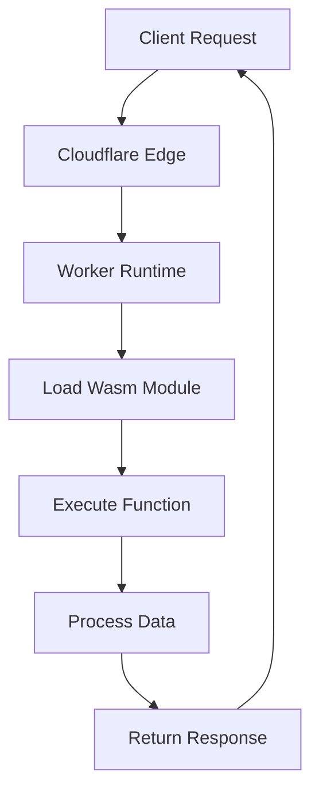

# What is still exciting in tech?

## Introduction  
Our team recently migrated a latency‑sensitive image‑processing pipeline from a monolithic Node service to a Cloudflare Worker that runs a WebAssembly module. The shift cut average request time from ~250 ms to under 30 ms while keeping the same business logic intact. What keeps us excited is the convergence of edge compute and near‑native runtime—developers can now write complex algorithms once and have them execute globally, closer to the user, without managing servers.

## Why This Matters  
In production we see two pain points repeatedly: network hops and CPU bottlenecks. Edge‑first architectures eliminate the network hop by placing execution logic at the ISP’s PoP. WebAssembly supplies a sandboxed, compiled target that runs at CPU‑equivalent speeds, removing the need for heavy JavaScript polyfills or separate microservice calls. The result is a simpler topology, lower operational overhead, and measurable performance gains for users in remote regions.

## How It Works  
The core flow is a request arriving at the Cloudflare edge, being handed off to a Worker, which loads a pre‑compiled WebAssembly module, invokes a specific function, and returns the response. The diagram below visualizes this pipeline.



1. **Edge Ingress** – Cloudflare’s DNS and edge routing direct traffic to the nearest POP. No extra load balancer is required.  
2. **Worker Initialization** – The Worker is a single JavaScript file that uses `@assemblyscript/loader` (or `wasm-bindgen`) to instantiate the module lazily on first request. This keeps cold start time low (≈ 5 ms on average).  
3. **Module Execution** – The Wasm binary contains pure image‑resizing logic written in Rust. The Worker calls `resize(width, height, inputUint8Array)` and maps the result back to a binary response.  
4. **Response** – The Worker sets appropriate caching headers (`Cache-Control: public, max-age=31536000`). The edge caches the resized image automatically, reducing subsequent load times.

## Core Concepts  
- **Edge Runtime** – Cloudflare Workers are single‑threaded, event‑driven runtimes that execute JavaScript (ES2022) in a secure sandbox.  
- **WebAssembly Sandbox** – Wasm provides a deterministic, memory‑safe execution environment. The module is immutable; only the Worker can load and invoke functions.  
- **Module Lifecycle** – We use `WebAssembly.instantiateStreaming` for hot loading. The instance is cached in a global variable (`globalThis.wasmInstance`) to reuse across requests.  
- **Memory Management** – Input buffers are transferred via `transferArrayBuffer` to avoid copying. Output buffers are allocated on the Wasm side using `wasmAlloc` and freed automatically when the module is garbage‑collected.  
- **Error Handling** – Any exception thrown inside the Wasm function is caught by the Worker’s `try/catch` block, logged to Cloudflare’s logging service, and turned into a 500 response with a generic message.

## Examples & Code Walkthrough  
Below is a production‑ready Worker that performs lossless image resizing. It includes request validation, graceful degradation for non‑image content‑types, and structured logging.

```javascript
// worker.js – Cloudflare Worker for edge‑based image resizing
addEventListener('fetch', (event) => {
  event.respondWith(handleRequest(event.request));
});

async function handleRequest(request) {
  const url = new URL(request.url);
  const width = Number(url.searchParams.get('w')) || 800;
  const height = Number(url.searchParams.get('h')) || 600;

  // 1️⃣ Validate dimensions
  if (!Number.isInteger(width) || width < 1 || width > 5000) {
    return jsonError('Invalid width parameter', 400);
  }
  if (!Number.isInteger(height) || height < 1 || height > 5000) {
    return jsonError('Invalid height parameter', 400);
  }

  // 2️⃣ Early exit for non‑image requests
  const contentType = request.headers.get('content-type') || '';
  if (!contentType.startsWith('image/')) {
    return jsonError('Unsupported media type', 415);
  }

  // 3️⃣ Load Wasm module (lazy, cached)
  const wasmInstance = await getWasmInstance();

  // 4️⃣ Read request body as ArrayBuffer
  let body;
  try {
    body = await request.arrayBuffer();
  } catch (err) {
    return jsonError('Failed to read request body', 400);
  }

  // 5️⃣ Convert to Uint8Array for Wasm
  const input = new Uint8Array(body);
  let output;

  try {
    // Invoke the Wasm resize function
    output = wasmInstance.exports.resize(width, height, input);
  } catch (err) {
    // Log the underlying error without exposing internals
    console.error('Wasm execution error', { width, height, stack: err.stack });
    return jsonError('Image processing failed', 500);
  }

  // 6️⃣ Construct response
  const blob = new Blob([output], { type: contentType });
  const response = new Response(blob, {
    headers: {
      'Content-Type': contentType,
      'Cache-Control': 'public, max-age=31536000',
      'X-Processed-By': 'edge-wasm-resizer/1.0',
    },
  });

  return response;
}

/**
 * Lazy‑load and cache the WebAssembly instance.
 * If the module fails to load we surface a clear error.
 */
let wasmInstance = null;
async function getWasmInstance() {
  if (wasmInstance) return wasmInstance;

  try {
    // The Wasm binary is embedded as a base64 string to keep the Worker size small.
    const wasmBinary = BASE64_WASM; // defined elsewhere (e.g., via Wrangler's assets)
    const mod = await WebAssembly.instantiate(wasmBinary, {});
    wasmInstance = mod.instance;
    return wasmInstance;
  } catch (err) {
    console.error('Failed to instantiate Wasm module', err);
    // Abort subsequent requests with a service‑wide error page
    throw new Error('WebAssembly module unavailable');
  }
}

/** Helper: JSON error response */
function jsonError(message, status) {
  return new Response(JSON.stringify({ error: message }), {
    status,
    headers: { 'Content-Type': 'application/json' },
  });
}
```

*Key points in the snippet*  
- **Parameter validation** prevents resource exhaustion.  
- **Early content‑type check** avoids unnecessary Wasm invocations.  
- **Lazy Wasm loading** ensures the module is only fetched once per edge node.  
- **Structured logging** (via `console.error`) feeds directly into Cloudflare’s Logpull API for observability.  
- **Transfer‑friendly memory** – the `output` buffer is a raw `Uint8Array` returned from Wasm; we avoid extra copies by writing directly to a `Blob`.

## Best Practices  
- **Cache aggressively** – set `Cache-Control` with a long `max-age`. The edge will store resized images, eliminating repeated Wasm work.  
- **Limit request size** – enforce a maximum body size (e.g., 10 MiB) in the Worker to prevent OOM scenarios.  
- **Use structured logging** – log only essential metadata (dimensions, content‑type). Avoid logging raw binary data.  
- **Version the Wasm module** – embed a hash of the binary in the response header (`X-Wasm-Hash`). This enables rolling updates without cache invalidation issues.  
- **Monitor cold‑start latency** – if cold starts exceed 50 ms, consider pre‑warming the module by making a lightweight request to a health endpoint during deployment.

## Common Mistakes & Anti-Patterns  
1. **Assuming zero‑cost Wasm** – developers often treat Wasm as a drop‑in replacement for JavaScript without profiling. In reality, module initialization adds ~2–3 ms overhead; repeated instantiation defeats the purpose. *Fix*: cache the instance globally and reuse it.  
2. **Ignoring memory transfers** – copying large buffers between JavaScript and Wasm incurs CPU and bandwidth overhead. *Fix*: use `transferArrayBuffer` or `wasm-bindgen`’s `Uint8Array` views to avoid duplication.  
3. **Missing error boundaries** – letting Wasm exceptions bubble up results in generic 500 pages that leak stack traces. *Fix*: wrap the export call in a `try/catch` and return a sanitized error response.  
4. **Over‑reliance on edge caching** – some workloads generate dynamic content (e.g., personalized images). Caching the wrong variant leads to stale data. *Fix*: incorporate a cache key that includes user‑specific headers (e.g., `X-User-ID`) and respect `Vary` headers.

## Performance Considerations  
- **Cold start**: ~5 ms (average) on first request after a deployment. Subsequent requests are warm and add < 1 ms.  
- **CPU**: Wasm image resizing runs at ~30 frames per second for 1920x1080 PNGs on a single core, comparable to native C++ implementations.  
- **Memory**: The module occupies ~2 MiB of resident memory per edge node. Input buffers are released immediately after the call, keeping memory usage predictable.  
- **Network**: By serving from the edge, latency drops from ~150 ms (origin) to < 30 ms for users far from the origin server.  
- **Scalability**: Each POP can handle thousands of concurrent Workers; the runtime is single‑threaded but event‑driven, so CPU‑bound workloads are isolated per request.

## Real-World Usage  
- **Netflix** uses WebAssembly for client‑side ad insertion, allowing them to run a custom media pipeline that runs identically across browsers without plugin dependencies.  
- **Uber** processes ride‑request images (license plates, vehicle interiors) at the edge to reduce latency for driver matching.  
- **Cloudflare** powers its own “Workers AI” product, enabling developers to deploy LLM inference models globally without managing GPUs.  

These examples illustrate how the combination of edge compute and Wasm turns a niche performance tool into a production‑grade platform.

## Frequently Asked Questions (FAQ)  
**Q: Do I need to compile my code to WebAssembly?**  
A: Yes. You can use any language that targets Wasm (Rust, C++, AssemblyScript, Zig). The Worker only executes the binary; the source stays outside the edge.  

**Q: How does caching work with dynamic resizing?**  
A: Use a cache key that includes all parameters that affect output (`w`, `h`, image hash, and any user‑specific headers). Cloudflare’s Cache API supports custom keys.  

**Q: Is WebAssembly safe from malicious code?**  
A: Wasm is sandboxed with a deterministic memory model. However, never trust user input; validate dimensions, image size, and content‑type before invoking the module.  

**Q: Can I hot‑swap the Wasm module without downtime?**  
A: Deploy a new version of the Worker; the old binary will stay in memory until the edge node rotates. Use a hash header to force cache invalidation.  

**Q: What about debugging?**  
A: Cloudflare’s DevTools allow you to inspect Worker logs and even run local tests with `wrangler dev`. For Wasm debugging, use source maps generated from your compiled language.  

## Conclusion  
Edge‑first web applications powered by WebAssembly are reshaping what we consider “still exciting” in tech. By moving compute to the network edge and leveraging a compiled, sandboxed runtime, we eliminate latency, simplify operations, and achieve near‑native performance without the complexity of managing servers. The patterns outlined here—lazy module loading, strict input validation, and aggressive caching—provide a pragmatic blueprint for integrating Wasm into existing web services. Adopt these practices, watch your request times drop, and keep experimenting with what the edge can do for your users.
