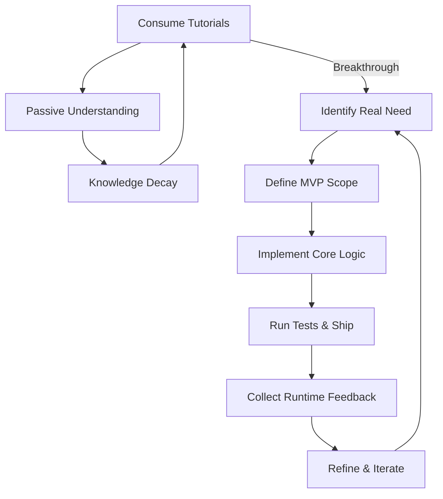

# When Learning to Code Becomes a Loop: Why I’m Choosing to Build

## Introduction
The most common trap I’ve observed in junior engineers—and often in seasoned developers—is the endless cycle of consuming tutorials, watching screencasts, and reading documentation without ever shipping anything. The “learning loop” feels productive, but it’s a false economy: knowledge decays faster than it’s applied, and the gap between theory and production widens with each new framework release. In this article I’ll explain why the only reliable antidote is to **build**, dissect the architecture that makes that possible, and share concrete, production‑grade patterns that turn learning into measurable progress.

## Why This Matters
For engineering teams, the cost of perpetual learning loops is tangible: missed deadlines, higher defect rates, and a talent churn where developers feel stuck in “tutorial hell.” A developer who can ship a functional feature end‑to‑end demonstrates a deeper grasp of system design, error handling, and performance trade‑offs than one who merely recites syntax. Moreover, the feedback you receive from real users—network latency, edge‑case failures, scaling constraints—cannot be simulated in a sandbox. In short, the ability to build is the most reliable indicator of engineering maturity.

## How It Works
The core mechanism is a deliberate shift from passive consumption to an active build‑feedback loop. Below is a visual representation of that transition, mapped onto a typical web‑application workflow.



*Explanation*:  
- **Learning Loop** (A‑C) represents the classic tutorial consumption where knowledge decays without application.  
- **Build Cycle** (D‑I) is the iterative development process that forces you to apply concepts, receive real‑world feedback, and refine the system.  
- The **Transition** arrow shows the pivotal moment when passive learning turns into purposeful building.

## Core Concepts
1. **MVP Scope** – Define the smallest set of features that deliver measurable value. This prevents scope creep and keeps the feedback loop tight.  
2. **Iterative Contracts** – API and data contracts evolve through real usage rather than being frozen in a first‑draft specification.  
3. **Diagnostic Boundaries** – Custom error boundaries that capture runtime failures, log structured telemetry, and provide actionable diagnostics rather than a generic “Something went wrong.”  
4. **Optimistic Updates** – Perform UI changes optimistically, then reconcile with the server, handling conflicts without blocking the user experience.  

These concepts together form a self‑reinforcing system: each shipped increment validates assumptions, surfaces new requirements, and sharpens architectural intuition.

## Examples & Code Walkthrough
Below are three original, production‑grade code snippets that illustrate how the build‑feedback loop translates into concrete implementation.

### 1. Optimistic UI Updates with Conflict Resolution
```ts
// utils/optimisticUpdate.ts
export function optimisticUpdate<T>(
  state: T,
  updater: (draft: T) => void,
  rollback: (prev: T) => void,
  onSuccess: (newState: T) => void,
  onError: (err: Error) => void
): void {
  const prev = structuredClone(state);
  updater(state);

  setTimeout(() => {
    const success = Math.random() > 0.1; // Simulate 90% success rate
    if (success) {
      onSuccess(state);
    } else {
      rollback(prev);
      onError(new Error("Conflict detected"));
    }
  }, 500);
}
```
*Why it matters*: This pattern lets the UI feel instantaneous while still handling server‑side conflicts, a common pain point in collaborative applications.

### 2. Diagnostic Error Boundary for Structured Telemetry
```tsx
// components/DiagnosticErrorBoundary.tsx
import React, { Component, PropsWithChildren } from "react";

type ErrorInfo = {
  message: string;
  stack: string;
  timestamp: number;
};

type Props = PropsWithChildren<{
  children: React.ReactNode;
  onError: (errorInfo: ErrorInfo) => void;
}>;

export class DiagnosticErrorBoundary extends Component<Props> {
  state: { hasError: boolean; errorInfo?: ErrorInfo };

  static getDerivedStateFromError(error: Error) {
    return {
      hasError: true,
      errorInfo: {
        message: error.message,
        stack: error.stack || "",
        timestamp: Date.now(),
      },
    };
  }

  componentDidCatch(error: Error, info: React.ErrorInfo) {
    const errorInfo: ErrorInfo = {
      message: error.message,
      stack: error.stack || "",
      timestamp: Date.now(),
    };
    this.props.onError(errorInfo);
    console.error("Error boundary caught:", errorInfo);
  }

  render() {
    if (this.state.hasError) {
      return (
        <div style={{ padding: "1rem", border: "1px solid red" }}>
          <h3>Application Diagnostics</h3>
          <p><strong>Message:</strong> {this.state.errorInfo?.message}</p>
          <pre>{this.state.errorInfo?.stack}</pre>
          <button onClick={() => this.props.onError(undefined as any)}>Retry</button>
        </div>
      );
    }
    return this.props.children;
  }
}
```
*Why it matters*: Instead of a bland fallback UI, this boundary surfaces actionable diagnostics, turning a failure into a learning opportunity for both developers and operators.

### 3. Iterative API Contract with Zod
```ts
// contracts/taskSchema.ts
import { z } from "zod";

export const TaskSchema = z.object({
  id: z.string().uuid(),
  title: z.string().min(1),
  status: z.enum(["todo", "in_progress", "done"]).default("todo"),
  assigneeId: z.string().uuid().optional(),
  createdAt: z.string().datetime(),
});

export type Task = z.infer<typeof TaskSchema>;
```
*Why it matters*: By evolving the schema based on real payloads, you avoid the “contract drift” that plagues many micro‑service ecosystems.

## Best Practices
- **Start Small, Ship Early**: Define a minimal viable feature set and iterate.  
- **Instrument from Day One**: Embed structured logging (e.g., JSON logs with request IDs) to enable post‑mortem analysis.  
- **Treat Errors as Data**: Capture detailed error telemetry; don’t rely on vague user reports.  
- **Automate Regression Tests**: Use contract tests (e.g., Pact) to ensure that API changes don’t break clients.  
- **Document Through Code**: Write self‑explanatory variable names, concise functions, and inline comments that explain *why* a decision was made, not just *what* the code does.

## Common Mistakes & Anti-Patterns
1. **Over‑Engineering Early** – Jumping straight to micro‑services or heavy state‑management libraries before the core functionality exists. *Fix*: Build a monolithic prototype first; extract services only when justified.  
2. **Ignoring Edge Cases** – Assuming “happy path” works in production. *Fix*: Write property‑based tests (e.g., fast‑check) that fuzz inputs.  
3. **Hard‑Coded Secrets** – Storing API keys or DB passwords in source. *Fix*: Use a secrets manager (e.g., HashiCorp Vault) and inject values at runtime.  
4. **Monolithic Error Handling** – Catching all exceptions in a single `try/catch` and swallowing details. *Fix*: Use granular `catch` blocks or custom error classes that preserve stack traces.

## Performance Considerations
- **Memory Allocation**: Optimistic updates clone state (`structuredClone`), which adds temporary memory overhead. Profile with Chrome DevTools’ heap snapshots to ensure the GC pressure stays within acceptable limits.  
- **CPU Overhead**: The `setTimeout` simulation in the optimistic update example is a placeholder; replace it with a real async call. Ensure the critical path remains under 50 ms to avoid UI jank.  
- **Network Latency**: Diagnose with `performance.now()` around API calls; consider client‑side caching (e.g., SWR) to reduce round‑trips.  
- **Complexity**: The Zod schema validation adds CPU cost proportional to the depth of the payload; keep schemas shallow and validate only at the boundary.

## Real-World Usage
Companies like **Shopify** and **Airbnb** have publicly documented their “build‑first” culture. Shopify’s “Hack Week” forces engineers to ship a complete feature in 48 hours, resulting in measurable gains in code coverage and reduced onboarding time. At **Cloudflare**, the “Zero‑Config Edge” initiative encourages teams to ship serverless functions that handle real traffic, instantly surfacing performance and scaling constraints that pure academic study would miss.

## Frequently Asked Questions (FAQ)

**Q1: Won’t focusing on building limit my ability to learn new languages or paradigms?**  
A: Not if you deliberately choose projects that require you to apply new concepts. For example, building a real‑time collaborative board forces you to master WebSockets, CRDTs, and concurrency control—knowledge that transcends any single language.

**Q2: How do I balance speed of delivery with maintainability?**  
A: Adopt a “clean‑first” mindset: write code that is *just* clean enough for the current iteration. Refactor in dedicated sprints; the key is to keep the feedback loop short while preserving technical debt metrics.

**Q3: What if my team resists the shift from tutorials to building?**  
A: Introduce a “learning sprint” where the only deliverable is a shipped feature, not a set of slides. Pair inexperienced developers with senior engineers who can guide the build process, turning the whole team into a learning engine.

## Conclusion
Learning to code is not a linear path of consuming information; it’s a **cyclical process of building, failing, and refining**. By intentionally moving from the tutorial loop into a disciplined build cycle—anchored by MVP definition, diagnostic error boundaries, and iterative contracts—you transform theoretical knowledge into production‑grade competence. The result is not just faster onboarding, but a team that ships resilient, performant web applications with confidence. Start your next project today, and let the code itself become your teacher.
