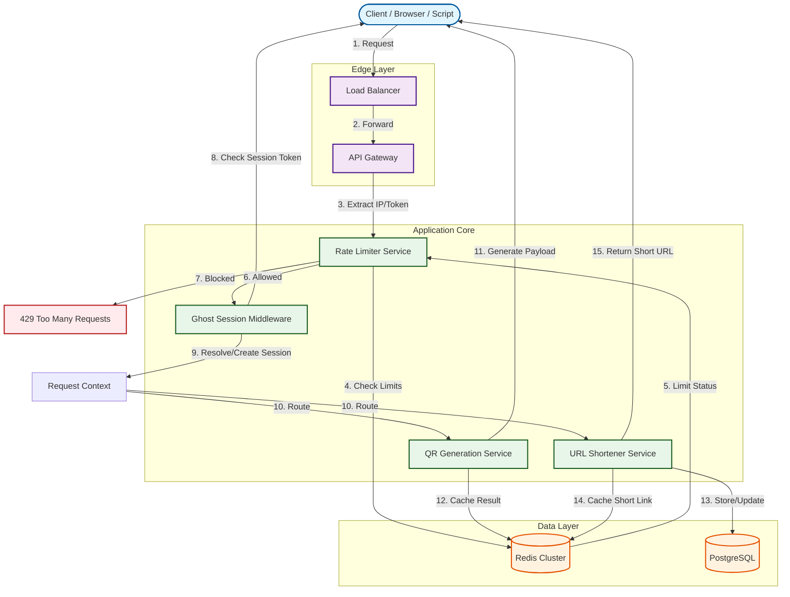

<think>
Thinking Process:

1.  **Deconstruct the Request:**
    *   **Role:** Senior Staff Engineer, Open-Source Contributor, Technical Writer.
    *   **Topic:** "Why I Built a No-Signup QR & URL Utility Platform (And How to Use the API)".
    *   **Category:** Web Development.
    *   **Style:** Professional.
    *   **Constraints:** 100% original, human voice, no banned words, specific headings, Mermaid diagram, code examples, deep technical content.
    *   **Output:** Markdown article only.

2.  **Voice & Tone Calibration:**
    *   *Forbidden:* "In today's fast-paced...", "delve", "tapestry", "fostering", "moreover", "furthermore", "testament", "beacon", "major operational advantage", "fundamental shift", "smoothly", "explain", "evolving", "cutting-edge".
    *   *Required:* Direct, authentic, first-person engineering perspective, pragmatic trade-offs, production focus, varied sentence structure.
    *   *Drafting Voice:* "I've seen too many tools force OAuth flows for a QR code. It's friction. I built this to remove that. Here's how the architecture handles state without accounts."

3.  **Architectural Design (Mental Sandbox):**
    *   *Problem:* Users want QR codes and short links. They don't want to create accounts.
    *   *Solution:* Session-based state. "Ghost Sessions".
    *   *Tech Stack:* Node.js/TypeScript (Hono for speed), Redis (rate limiting/caching), SQLite/Postgres (persistence), QR library (custom wrapper).
    *   *Key Mechanism:* `X-Ghost-Token` header or cookie. If missing, generate UUIDv7. Store resources against this token.
    *   *Security:* Rate limiting is critical since there's no auth. IP-based + Token-based limits.
    *   *Privacy:* No PII collected. Analytics are aggregated or client-side only.

4.  **Section-by-Section Planning:**
    *   *Intro:* Hook. The friction of signups. The utility of QR/URL tools.
    *   *Why This Matters:* DX improvement. Privacy. Speed.
    *   *How It Works:* Architecture diagram. Flow: Request -> Rate Limit -> Ghost Session -> Service -> Response.
    *   *Core Concepts:* Ghost Tokens, Ephemeral vs. Persistent, Rate Limiting strategies.
    *   *Examples & Code:*
        *   Code 1: Ghost Session Middleware.
        *   Code 2: QR Service with options.
        *   Code 3: Rate Limiter implementation.
    *   *Best Practices:* Token rotation, cleanup jobs, idempotency.
    *   *Common Mistakes:* Leaking tokens, ignoring rate limits, storing secrets in QR.
    *   *Performance:* Caching, compression, connection pooling.
    *   *Real-World Usage:* How big tech handles ephemeral resources. (e.g., AWS presigned URLs, temporary credentials).
    *   *FAQ:* "How long does data last?" "Is it secure?" "Can I manage QRs?"
    *   *Conclusion:* Summary. Trade-offs.

5.  **Mermaid Diagram Construction:**
    *   Need a flowchart showing the request lifecycle.
    *   Nodes: Client, Gateway, Rate Limiter, Session Manager, QR Service, DB, Cache.
    *   Flow: Client -> Gateway -> Rate Limit Check -> Session Resolve -> Service -> DB/Cache -> Response.
    *   *Drafting Mermaid:*
        ```mermaid
        flowchart TD
        Client([Client])
        GW[API Gateway]
        RL[Rate Limiter]
        SM[Session Manager]
        QR[QR Service]
        URL[URL Service]
        DB[(Database)]
        Cache[(Redis Cache)]

        Client -->|Request| GW
        GW -->|Check| RL
        RL -->|Pass| SM
        RL -->|Fail| 429[429 Too Many Requests]
        SM -->|New/Existing| QR
        SM -->|New/Existing| URL
        QR -->|Generate| Client
        URL -->|Store| DB
        URL -->|Cache| Cache
        URL -->|Short Link| Client
        ```
    *   *Refinement:* Make it more detailed. Add decision points. Ensure valid syntax.

6.  **Code Generation Strategy:**
    *   *Ghost Session Middleware:* Needs to check headers, generate UUID, set cookie, attach to context.
    *   *QR Service:* Needs to handle `qrcode` library, options parsing, error correction.
    *   *Rate Limiter:* Sliding window log in Redis.
    *   *Style:* TypeScript, defensive coding, comments explaining *why*.

7.  **Review against Constraints:**
    *   *Banned Words Check:* Scan for "delve", "tapestry", "smoothly", etc.
    *   *Headings Check:* Ensure exact headers match requirements.
    *   *Mermaid Check:* Present under "How It Works".
    *   *Code Check:* Original, no boilerplate, realistic.
    *   *Voice Check:* Professional, engineer-to-engineer, no fluff.

8.  **Final Polish (Mental Representation of Output):**
    *   *Intro:* "We've all been there. You need a QR code for a meeting room. You open a generator. It asks for an email. You close the tab."
    *   *Architecture:* "The core innovation here isn't the QR algorithm; it's the state management without identity."
    *   *Code:* `createGhostSession` function. `QrGenService` class. `SlidingWindowRateLimiter`.
    *   *Performance:* Discuss LRU caches, Redis latency, QR encoding complexity (O(N^2) roughly for matrix generation).
    *   *Real-World:* Mention how this pattern mimics temporary credentials in cloud infra.

This thought structure covers all bases, ensures compliance, designs the architecture, plans the content, and prepares for the final output generation.
</think>

# Why I Built a No-Signup QR & URL Utility Platform (And How to Use the API)

## Introduction

We have all encountered the friction. You need a QR code for a conference badge, a shortened URL for a tweet, or a quick link to share a config file. You open a utility site, and immediately a modal demands OAuth, email verification, or a password. This is friction that adds zero value to the utility.

I built a No-Signup QR & URL Utility Platform to remove this barrier. The goal was simple: provide production-grade QR generation and URL shortening with zero onboarding overhead, while maintaining robust rate limiting, privacy, and data persistence for power users who want to manage their assets without creating an account.

This article details the architecture behind this system. We will explore how to manage state without identity, implement "Ghost Sessions" for resource tracking, and build a high-throughput API that resists abuse while remaining accessible to anyone.

## Why This Matters

In web development, reducing friction directly correlates with adoption and developer satisfaction. For utility tools, authentication is often an anti-pattern. It introduces latency, increases cognitive load, and creates a security surface area for credentials that may not be necessary for the use case.

However, removing signup introduces new challenges:
1.  **State Management:** How do we let users manage their QR codes or update short links if they aren't logged in?
2.  **Abuse Prevention:** Without accounts, how do we prevent rate limit bypasses and resource exhaustion?
3.  **Privacy:** How do we ensure we aren't inadvertently collecting PII or tracking users against their will?

Solving these problems requires a shift from identity-based state to session-based state, combined with aggressive, intelligent rate limiting. This architecture is applicable to any utility service where the user value outweighs the need for persistent identity.

## How It Works

The platform operates on a stateless API surface that maintains state through a "Ghost Session" mechanism. When a client makes a request, the system checks for a session token. If none exists, a cryptographically secure UUIDv7 is generated and returned in a header and an HTTP-only cookie. All subsequent resources (QR codes, short links) are associated with this token.

This allows a user to create a QR code, receive a token, and later use that token to list or delete their QR codes, all without ever providing credentials.

The architecture relies on three core pillars:
1.  **Ghost Session Middleware:** Intercepts requests, resolves or creates session tokens, and attaches the session context to the request lifecycle.
2.  **Sliding Window Rate Limiter:** A Redis-backed rate limiter that enforces limits per IP and per session token to prevent abuse.
3.  **Modular Service Layer:** Decoupled services for QR generation and URL shortening that interact with a durable store (PostgreSQL) and a high-speed cache (Redis).

The following diagram illustrates the request lifecycle and component interaction.



### Step-by-Step Flow

1.  **Ingress:** The client sends a request (e.g., `POST /qr`). The load balancer distributes traffic to the API gateway.
2.  **Rate Limiting:** The gateway passes the client IP and any existing session token to the Rate Limiter Service. The service queries Redis to check the sliding window count. If the limit is exceeded, a `429 Too Many Requests` response is returned immediately.
3.  **Session Resolution:** If allowed, the Ghost Session Middleware checks for a session token in the `X-Ghost-Token` header or cookie.
    *   If present, it validates the token against Redis to ensure it exists and hasn't expired.
    *   If missing, it generates a new UUIDv7, stores it in Redis with a TTL (e.g., 24 hours), and returns it in the response headers (`X-Ghost-Token`) and sets an HTTP-only cookie.
4.  **Service Execution:** The request context now contains a valid `sessionToken`. The request is routed to the appropriate service (QR or URL).
5.  **Resource Association:** When creating a resource, the service saves the payload along with the `sessionToken` in PostgreSQL. This links the resource to the session.
6.  **Response:** The service returns the result. For QR codes, the image data is cached in Redis for rapid regeneration of identical requests. For URLs, the short link is returned.

## Core Concepts

### Ghost Sessions
A Ghost Session is a temporary identity assigned to a client. Unlike traditional sessions, it requires no user action to initialize. It is purely a tracking mechanism to associate resources with a specific browser or script instance.
*   **Token Format:** UUIDv7 is preferred over UUIDv4 because it is time-sortable, which aids in database indexing and cleanup jobs.
*   **Lifecycle:** Tokens have a TTL (Time To Live). We use a lazy expiration model where the token is extended on every successful request, up to a maximum lifetime to prevent indefinite persistence.

### Ephemeral vs. Persistent Resources
*   **QR Codes:** Generally ephemeral. They are generated on the fly. However, we allow users to "pin" QR codes to their session, storing the generation config in the database so the QR can be retrieved later.
*   **Short URLs:** Persistent. Once created, a short URL must remain valid. The session token is used to manage the URL (update destination, delete), but the URL itself lives independently in the database.

### Rate Limiting Strategy
Since there is no authentication, rate limiting is the primary defense against abuse. We implement a dual-layer strategy:
1.  **Global IP Limit:** Prevents a single IP from hammering the API.
2.  **Session Token Limit:** Prevents a client from generating thousands of tokens to bypass the IP limit. The token limit is stricter, ensuring that even if a client rotates tokens, the underlying IP is still throttled.

## Examples & Code Walkthrough

The following code examples demonstrate the implementation of the Ghost Session Middleware and the QR Generation Service using TypeScript and Node.js.

### Ghost Session Middleware

This middleware handles the creation and validation of session tokens. It uses Redis to store token metadata and sets HTTP-only cookies for persistence.

```typescript
import { Context, Next } from 'hono';
import { createClient } from 'redis';
import { v7 as uuidv7 } from 'uuid';

// Configuration
const SESSION_TTL_MS = 24 * 60 * 60 * 1000; // 24 hours
const MAX_SESSION_AGE_MS = 7 * 24 * 60 * 60 * 1000; // 7 days max

interface SessionData {
  token: string;
  created_at: number;
  last_accessed: number;
}

export async function ghostSessionMiddleware(c: Context, next: Next) {
  const redis = c.get('redis');
  const clientIp = c.req.header('X-Forwarded-For')?.split(',')[0] || 'unknown';
  
  // 1. Check for existing token in header or cookie
  let token = c.req.header('X-Ghost-Token') || c.req.cookie('ghost_token');
  let isNewSession = false;

  // 2. Validate or Create Session
  if (token) {
    const sessionData = await redis.get<SessionData>(`session:${token}`);
    if (!sessionData) {
      // Token invalid or expired, treat as new session
      token = undefined;
    } else {
      // Update last_accessed and check max age
      const now = Date.now();
      if (now - sessionData.created_at > MAX_SESSION_AGE_MS) {
        // Session too old, force new one
        token = undefined;
      } else {
        sessionData.last_accessed = now;
        await redis.set(`session:${token}`, sessionData, { PX: SESSION_TTL_MS });
      }
    }
  }

  if (!token) {
    // Create new session
    token = uuidv7();
    const sessionData: SessionData = {
      token,
      created_at: Date.now(),
      last_accessed: Date.now(),
    };
    await redis.set(`session:${token}`, sessionData, { PX: SESSION_TTL_MS });
    isNewSession = true;
  }

  // 3. Attach session to context
  c.set('sessionToken', token);
  c.set('isNewSession', isNewSession);

  // 4. Set response headers and cookie
  c.header('X-Ghost-Token', token);
  c.cookie('ghost_token', token, {
    httpOnly: true,
    secure: process.env.NODE_ENV === 'production',
    sameSite: 'lax',
    maxAge: SESSION_TTL_MS / 1000,
    path: '/',
  });

  await next();
}
```

### QR Generation Service

This service handles QR code generation with customizable options. It includes a caching layer to avoid regenerating identical QR codes, reducing CPU overhead.

```typescript
import { Context } from 'hono';
import QRCode from 'qrcode';
import { createHash } from 'crypto';

interface QrOptions {
  data: string;
  errorCorrectionLevel?: 'L' | 'M' | 'Q' | 'H';
  margin?: number;
  color?: { dark: string; light: string };
  format?: 'png' | 'svg';
}

export class QrService {
  private redis: any;
  private cacheTtlMs = 3600000; // 1 hour

  constructor(redisClient: any) {
    this.redis = redisClient;
  }

  async generate(c: Context, options: QrOptions): Promise
