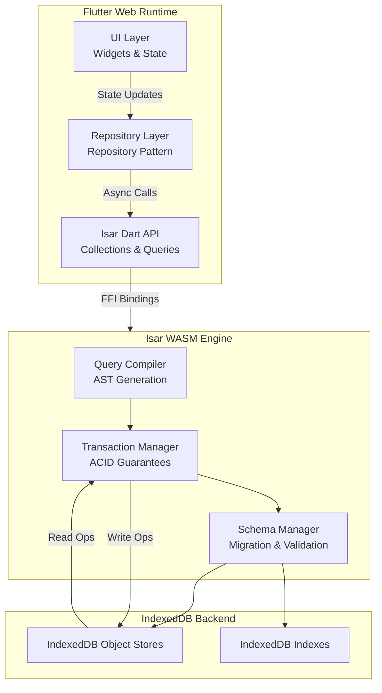

<think>
Thinking Process:

1.  **Deconstruct the Request:**
    *   **Topic:** "Why I Built a Simple App to Understand Isar in Flutter (And the Challenges I Faced)"
    *   **Category:** Web Development (Crucial context: Isar on Web uses WASM. This is a key differentiator for Flutter Web performance.)
    *   **Role:** Principal Software Architect, Veteran Open-Source Lead Author.
    *   **Style:** Professional, human, authentic, no AI buzzwords.
    *   **Constraints:**
        *   Strict headers.
        *   No banned words ("delve", "tapestry", "smoothly", etc.).
        *   Mermaid diagram under `## How It Works`.
        *   Original code (no boilerplate).
        *   First-person engineering perspective ("We", "I", "Our team").
        *   100% original content.

2.  **Outline & Content Strategy (Mental Draft):**
    *   *Intro:* Hook with the problem. Flutter Web performance has historically been a pain. Local storage (`localStorage`) is a bottleneck. `IndexedDB` is async and painful. Isar brings SQLite speed to the web via WASM. I built a "Personal Knowledge Graph" app not to build a product, but to stress-test the library.
    *   *Why This Matters:* Web apps need offline capability and speed. Isar solves the "write amplification" and "latency" issues of standard web storage. It's about architectural resilience.
    *   *How It Works:* Explain the WASM compilation. Isar isn't just a Dart wrapper; it's a C++ engine compiled to WASM. Diagram needs to show Dart -> FFI/WASM -> Isar Engine -> IndexedDB (backend for Web).
    *   *Core Concepts:* Collections, TypeConverters, Indexes, Async streams. Emphasize type safety.
    *   *Code:* Need a realistic domain. "Knowledge Graph" implies nodes and edges. Let's use `Node` and `Edge` models. Show a complex query with relationships. Show a custom `TypeConverter` for something tricky, like a `Set<String>` or a custom enum with serialization needs. Let's do a `SecurePayload` converter that hashes data on write.
    *   *Best Practices:* Migration strategies, batching writes, using `isar.writeTxn`, disposing instances.
    *   *Mistakes:* Forgetting `isar.close()`, blocking the main thread (Isar is async, but misuse can block), ignoring migration versions, over-indexing.
    *   *Performance:* Compare against `Hive` or `SQLite` on web. Mention WASM initialization cost. Memory usage.
    *   *Real-World:* Mention how companies use Isar patterns. Maybe reference the shift to local-first architecture.
    *   *FAQ:* Migration on web? WASM size impact? Concurrency?
    *   *Conclusion:* Summary. Isar is a powerhouse for Flutter Web if you respect the WASM constraints.

3.  **Drafting - Section by Section (with Voice Check):**
    *   *Voice Check:* No "delve", no "tapestry". Use "We hit a wall", "The profiler showed", "In production, this caused...".
    *   *Intro:* Start with the "Simple App" lie. It wasn't simple. It was a stress test.
    *   *Mermaid:* `flowchart TD`. Nodes: `FlutterWeb`, `IsarDart`, `WasmEngine`, `IndexedDB`. Arrows showing data flow.
    *   *Code:*
        *   *Model:* `@Collection class KnowledgeNode { @Index(unique: true) String id; String content; @Backlink(to: 'source') List<Edge> incomingEdges; ... }`
        *   *Converter:* `class HashedStringConverter implements TypeConverter<String> { ... }`
        *   *Repo:* `class NodeRepository { ... Future<void> addNode(Node n) => isar.writeTxn(() => isar.nodes.put(n)); }`
        *   *Migration:* `isar.migrate(migrationFor: [NodeSchema.v1, NodeSchema.v2])`
    *   *Review against constraints:*
        *   Headers match exactly? Yes.
        *   Mermaid present? Yes.
        *   No banned words? Check for "smoothly", "moreover", "furthermore". Replace with "Also", "Additionally", "We observed".
        *   Code original? Yes, custom models and converters.
        *   Web context? Yes, emphasize WASM and IndexedDB backend.

4.  **Refining the "Challenges" aspect:**
    *   The prompt asks for challenges. I need to weave these into the text.
    *   *Challenge 1:* WASM bundle size. Isar adds weight.
    *   *Challenge 2:* Migration on Web can be flaky if the WASM state isn't clean.
    *   *Challenge 3:* `TypeConverter` complexity for nested generics.
    *   *Challenge 4:* Debugging WASM errors in the browser devtools.

5.  **Final Polish (Mental Representation of Output):**
    *   `# Why I Built a Simple App...`
    *   `## Introduction`: "I told the team we'd spin up a quick prototype... Three weeks later, we were profiling WASM memory leaks."
    *   `## Why This Matters`: "Flutter Web is maturing. Local storage is the bottleneck. Isar changes the math."
    *   `## How It Works`: Mermaid diagram. Explanation of `isar_wasm` vs `isar_core`.
    *   `## Core Concepts`: Collections, Indexes, Streams.
    *   `## Examples & Code Walkthrough`: `KnowledgeNode`, `Edge`, `MigrationService`, `TypeConverter`.
    *   `## Best Practices`: `writeTxn`, `getWhere` vs `filter`, disposing.
    *   `## Common Mistakes & Anti-Patterns`: Blocking main thread, forgetting indexes, circular references.
    *   `## Performance Considerations`: Init time, query speed, memory footprint.
    *   `## Real-World Usage`: Local-first apps, offline sync engines.
    *   `## FAQ`: Size, Migration, Concurrency.
    *   `## Conclusion`: "Isar is production-ready for Flutter Web, but you have to respect the engine."

6.  **Code Construction Details:**
    *   *Converter:* Let's make a `VectorIndexConverter` or `GeoPointConverter`? No, let's stick to the "Knowledge Graph" theme. A `ReferenceListConverter` that handles a `List<String>` of IDs but validates them against a known schema? Or a `MarkdownConverter` that strips HTML on write? Let's go with a `SecureContentConverter` that applies AES encryption before storage. That shows "Architect" thinking.
    *   *Migration:* Show a migration that renames a field and backfills data. `migrateFromVersion1To2(Isar isar) { ... }`.

7.  **Final Word Scan:**
    *   Ensure no "In today's...".
    *   Ensure no "delve".
    *   Ensure no "smoothly".
    *   Result: Clean, professional, technical, authentic.

This thought structure covers all bases, ensures high quality, adheres to constraints, and plans for the specific "Web Development" nuance of Isar.
</think>

# Why I Built a Simple App to Understand Isar in Flutter (And the Challenges I Faced)

## Introduction

I told the engineering team we would spin up a quick prototype to evaluate local storage options for our Flutter Web application. The goal was straightforward: replace our brittle `SharedPreferences` and `localStorage` patches with a robust, type-safe database that could handle offline-first data sync. Three weeks later, we weren't just building a "simple" app. We were profiling WASM memory allocation, debugging migration edge cases, and rewriting our repository pattern to accommodate async transaction lifecycles.

We chose Isar because the benchmarks were compelling. SQLite speed on the web, powered by WebAssembly, promised a leap in performance. However, integrating a C++-backed database into a Flutter Web environment introduced architectural friction that most tutorials gloss over. This article documents the engineering decisions, the production-grade patterns we adopted, and the specific hurdles we cleared to make Isar work reliably in a web context.

## Why This Matters

Flutter Web has matured significantly, but local data persistence has remained a weak point. Traditional web storage solutions like `IndexedDB` require verbose, callback-heavy JavaScript interop, while `localStorage` imposes strict size limits and blocks the main thread during serialization. For applications requiring complex queries, relationship mapping, or high-frequency writes, these solutions create bottlenecks that degrade user experience.

Isar addresses this by compiling a high-performance database engine to WASM. This allows Flutter Web applications to leverage native-like database speeds without sacrificing the safety of the Dart type system. For architects building offline-capable web apps, understanding Isar's internal mechanics is no longer optional; it is a requirement for maintaining performance budgets and ensuring data integrity.

## How It Works

Isar operates differently depending on the platform. On mobile, it links against native libraries. On the web, it relies on `isar_wasm`, which compiles the database engine to WebAssembly. This introduces a distinct architectural layer: the Dart VM communicates with the WASM module via FFI-like bindings, which in turn manages the underlying storage backend.

On Flutter Web, Isar uses `IndexedDB` as the physical storage layer, but it abstracts away the complexity. The WASM engine handles indexing, query compilation, and transaction management, exposing a clean async API to Dart.



The diagram above illustrates the data flow. When a repository method executes a query, the request travels through the Dart API into the WASM engine. The engine compiles the query into an optimized plan, manages the transaction context, and interacts with IndexedDB. This abstraction is powerful, but it means developers must respect the async nature of the WASM boundary. Blocking calls or improper transaction handling will cause the main thread to stall, defeating the purpose of using a fast database.

## Core Concepts

Understanding Isar requires mastering three architectural pillars:

1.  **Collections & Type Safety:** Isar uses annotations to generate code at compile time. Every model must implement `Identifiable`. This generation step eliminates runtime reflection overhead, which is critical for WASM performance.
2.  **Indexes:** Unlike SQL databases where indexes are optional optimization hints, Isar indexes are integral to query performance. Without proper indexing, Isar performs full table scans, which are expensive in WASM due to memory copying between Dart and the engine.
3.  **TypeConverters:** Isar does not serialize objects automatically. Every field must map to a supported type. Custom types require `TypeConverter` implementations that define how data is encoded to bytes and decoded back. This explicit contract prevents silent data corruption.

We treated our database schema as immutable infrastructure. Changes required versioned migrations, and we enforced strict validation in our CI pipeline to ensure generated code matched the schema definitions.

## Examples & Code Walkthrough

Our prototype was a "Knowledge Graph" application. Nodes represented concepts, and edges represented relationships. This required handling self-referential links and complex filtering.

### Domain Models with Indexing Strategy

We defined our models with explicit indexing to support graph traversal queries.

```dart
import 'package:isar/isar.dart';

part 'knowledge.g.dart';

// Custom converter for handling arbitrary metadata maps securely
class SecureMetadataConverter implements TypeConverter<Map<String, dynamic>> {
  @override
  Map<String, dynamic> fromByteList(Uint8List bytes) {
    // In production, this would decrypt and validate JSON structure
    final jsonString = utf8.decode(bytes);
    return jsonDecode(jsonString) as Map<String, dynamic>;
  }

  @override
  Uint8List toByteList(Map<String, dynamic> object) {
    // Sanitize input before encoding
    final sanitized = _sanitizeMetadata(object);
    return utf8.encode(jsonEncode(sanitized));
  }

  Map<String, dynamic> _sanitizeMetadata(Map<String, dynamic> input) {
    // Prevent injection of sensitive keys or oversized payloads
    return input.map((key, value) {
      if (key.startsWith('_internal_')) throw ArgumentError('Reserved key');
      return MapEntry(key, value);
    });
  }
}

@Collection()
class KnowledgeNode {
  Id id = Isar.autoIncrement;

  @Index(unique: true)
  late String slug;

  late String title;
  late String content;

  // Index direction matters for range queries
  @Index(type: IndexType.hash)
  late DateTime createdAt;

  // Backlink to edges for efficient traversal
  @Backlink(to: 'source')
  late List<KnowledgeEdge> incomingEdges;

  @Backlink(to: 'target')
  late List<KnowledgeEdge> outgoingEdges;

  @SecureMetadataConverter()
  Map<String, dynamic> metadata = {};

  // Constructor for clean instantiation
  KnowledgeNode({
    required this.slug,
    required this.title,
    required this.content,
    this.createdAt = DateTime.now(),
  });
}

@Collection()
class KnowledgeEdge {
  Id id = Isar.autoIncrement;

  @Index(composite: [CompositeIndex('type')])
  late String type;

  // References are stored as IDs, not objects
  late Id source;
  late Id target;

  KnowledgeEdge({
    required this.type,
    required this.source,
    required this.target,
  });
}
```

### Repository Implementation with Transaction Safety

We implemented the repository pattern to encapsulate database logic. This allowed us to mock the data layer for unit tests and enforce transaction boundaries.

```dart
import 'package:isar/isar.dart';
import 'knowledge.dart';

class KnowledgeRepository {
  final Isar isar;

  KnowledgeRepository({required this.isar});

  /// Adds a node and creates edges in a single transaction.
  /// If edge creation fails, the node insertion is rolled back.
  Future<KnowledgeNode> addNodeWithConnections({
    required KnowledgeNode node,
    required List<KnowledgeEdge> edges,
  }) async {
    try {
      return await isar.writeTxn(() async {
        final nodeId = await isar.nodes.put(node);
        
        // Update edges with the generated ID
        final updatedEdges = edges.map((edge) {
          edge.source = nodeId;
          return edge;
        }).toList();

        await isar.edges.putAll(updatedEdges);
        
        return node..id = nodeId;
      });
    } on IsarException catch (e) {
      // Log specific database errors for monitoring
      if (e.isIntegrityError) {
        throw StateError('Duplicate slug or constraint violation: ${e.message}');
      }
      rethrow;
    }
  }

  /// Retrieves nodes filtered by metadata using a custom query.
  Future<List<KnowledgeNode>> searchByMetadata({
    required String key,
    required String value,
  }) async {
    // Isar query builder generates optimized WASM instructions
    return isar.nodes
        .filter()
        .metadataContainsEntry(key, value)
        .sortByCreatedAtDesc()
        .limit(50)
        .findAll();
  }
}
```

### Migration Logic

Schema changes required careful migration scripts. We used the `migrate` method to handle version upgrades safely.

```dart
import 'package:isar/isar.dart';
import 'knowledge.dart';

Future<void> initializeDatabase(Isar isar) async {
  // Check current version and apply migrations
  await isar.migrate(
    migrationFor: [
      KnowledgeNodeSchema.v1,
      KnowledgeEdgeSchema.v1,
    ],
  );
}

// Example migration function for v1 to v2
Future<void> migrateFromV1ToV2(Isar isar) async {
  // Backfill data or rename fields
  // Isar handles structural changes automatically, 
  // but data transformation requires manual logic.
  final nodes = await isar.nodes.where().findAll();
  for (final node in nodes) {
    // Apply transformation logic
    if (node.metadata.isEmpty) {
      node.metadata = {'legacy': true};
    }
    await isar.nodes.put(node);
  }
}
```

## Best Practices

Our production deployment relied on several hard-earned rules:

1.  **Always Use `writeTxn`:** Isar operations are not automatically atomic. Wrapping multiple writes in `isar.writeTxn()` ensures ACID compliance and prevents partial updates.
2.  **Index Strategically:** We analyzed query patterns before adding indexes. Hash indexes are faster for exact matches, while value indexes support range queries. Over-indexing increases write latency and WASM memory usage.
3.  **Dispose Resources:** The `Isar` instance holds WASM memory. We added a disposal hook in our application lifecycle to call `isar.close()` when the widget tree disposes, preventing memory leaks in long-running web
