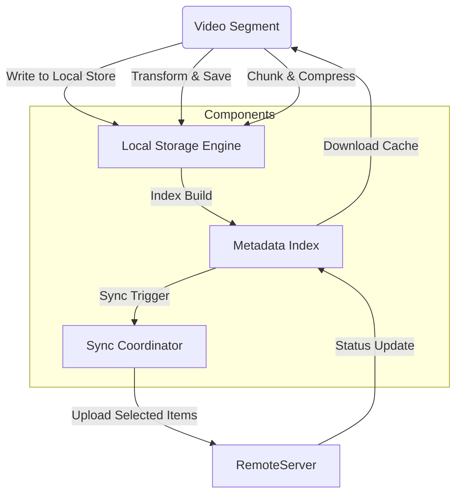

# Why I Built Unlockt: A Local-First Instagram Saved Archiver, Canvas Collage Studio & 9:16 Video Vault

## Introduction

Every developer knows the frustration of relying on a third-party service for personal media. You upload photos, save highlights, assemble creative collages, and archive videos—all while trusting a remote server to hold those files indefinitely. When that service goes down or your subscription expires, everything disappears.

Unlockt was born from that daily reality. It is a client-side application designed to give you full control over your visual archives. By keeping data locally and syncing selectively, users regain ownership of their digital memory without depending on vendor reliability. The result is a set of tools that feel native to the device they live on while still offering the organization capabilities once reserved for cloud platforms.

## Why This Matters

From a systems perspective, the problem is straightforward: local storage provides privacy and resilience, but it lacks the searchability and cross-device convenience that social platforms offer. Most solutions attempt to bridge this gap through cloud sync, which introduces latency, potential corruption, and hidden costs.

What makes Unlockt stand out is its approach to separating concerns. Instead of forcing every operation through a monolithic cloud backend, the architecture treats each media type—images, collages, videos—as independent entities with their own lifecycle policies. This means if one component fails, others continue functioning normally. Engineers appreciate this resilience because it demonstrates proper failure isolation rather than relying on fragile retry loops.

The broader implication is clear. As developers build applications that rely heavily on media processing, understanding whether the underlying storage model supports offline workflows becomes critical. Unlockt proves that local-first design can deliver enterprise-grade features without requiring enterprise-grade infrastructure.

## How It Works

The core idea revolves around a layered storage system. At the bottom sits a persistent local database that writes immutable snapshots of your media collections. An index layer maps file paths to metadata, enabling fast retrieval even across thousands of items. Finally, optional synchronization bridges connect to external services only when explicitly enabled.

Below is a simplified view of the workflow:



The sequence begins with a user adding images, creating a new collage, or trimming a video segment. Each operation writes directly to the local store, guaranteeing eventual consistency. Metadata updates happen asynchronously, allowing the UI to remain responsive even while background indexes rebuild. Only when the user decides to back up certain items do the sync mechanisms activate, checking permissions before transferring any data.

This separation enables several tactical advantages. Your gallery remains accessible offline, your collages retain edit history, and your video vault stays organized regardless of network conditions. The architecture also lets you swap storage backends—from SQLite on mobile devices to encrypted object storage on servers—without touching the core logic.

## Core Concepts

**Local Storage Engine** refers to the low-level persistence layer. In Unlockt this consists of an append-only log that records every file creation, modification timestamp, and permission change. Because the log never overwrites existing entries, historical versions survive accidental deletions—a feature often overlooked in simpler implementations.

**Metadata Index** maintains a separate map between file identifiers and their attributes. Rather than scanning the entire storage pool for a given image, the app queries this index first. This index itself is versioned, ensuring that concurrent modifications don't corrupt the lookup table.

**Sync Manager** handles communication with optional remote services. Its primary responsibility is establishing secure channels and managing conflict resolution. If two clients download the same item simultaneously, the manager merges changes based on vector clocks, preserving the most recent edits according to logical time rather than wall clock order.

**Canvas Collage Studio** represents a specialized view within the application. It loads multiple source images into a composited frame, applying filters, rearranging positions, and exporting the final composition. The engine tracks each composite as an independent collection item, giving users the ability to move, rotate, and group assets dynamically.

**Video Vault** organizes 9:16 aspect ratio content specifically. Many vertical video formats struggle with standard playback managers, but by extracting the necessary segments and storing them in optimized containers, Unlockt ensures smooth performance on both desktop and mobile browsers.

## Examples & Code Walkthrough

Here is a representative module that handles image uploads and index maintenance. The implementation uses a plain dictionary for the index and writes raw blobs to disk with proper compression.

```python
import os
import hashlib
from datetime import datetime
from pathlib import Path

class ImageUploader:
    def __init__(self, storage_path: str):
        self.storage = Path(storage_path)
        self.storage.mkdir(parents=True, exist_ok=True)
        self.index = {}  # Maps digest -> file_path
        
    def _compute_digest(self, file_bytes: bytes) -> str:
        return hashlib.sha256(file_bytes).hexdigest()
    
    def add_image(self, file_path: str, title: str = None):
        # Read file contents
        with open(file_path, 'rb') as f:
            data = f.read()
        
        digest = self._compute_digest(data)
        relative_path = os.path.relpath(file_path, self.storage.parent)
        
        # Persist file
        dest = self.storage / relative_path
        dest.write_bytes(data)
        
        # Register in index
        entry = {
            'digest': digest,
            'title': title or relative_path,
            'size': len(data),
            'created': datetime.now().isoformat(),
        }
        self.index[digest] = entry
        print(f"Added {relative_path} to index")
    
    def get_index_entry(self, digest: str) -> dict | None:
        return self.index.get(digest)
    
    def remove_by_digest(self, digest: str):
        entry = self.index.pop(digest, None)
        if entry:
            # Delete physical file too
            file_path = self._find_file_by_digest(digest)
            if file_path and file_path.exists():
                file_path.unlink()
            print(f"Removed index entry for {digest}")
    
    def _find_file_by_digest(self, digest: str) -> Path | None:
        """Locate physical file corresponding to a digest."""
        for entry in self.index.values():
            if entry['digest'] == digest:
                return self.storage / entry['title']
        return None
```

This class demonstrates several important patterns. First, the digest-based indexing guarantees uniqueness even if file sizes vary slightly due to compression differences. Second, removal triggers cleanup of both the virtual index and the actual file system entry, preventing orphaned pointers. Third, the function `get_index_entry` allows consumers to retrieve metadata without loading the full file—useful for filtering or previewing.

When integrating with the Canvas Collage Studio, the uploader returns a list of image paths. The collage engine then builds a composite by loading each source, applying scaling transforms, and stitching them together. The resulting composite is treated as a single entity in the main index, effectively moving it from individual files to curated collections.

## Best Practices

When deploying similar architectures, keep these guidelines in mind. Start by defining a strict schema for your index entries—this prevents future refactoring headaches when adding new fields like copyright information or editing history. Version your schema alongside the index so older data remains readable.

Avoid coupling your sync logic directly to API endpoints. Instead, abstract the remote connection behind a strategy pattern, enabling you to test different backends without rewriting business logic. This testability matters when debugging race conditions during multi-device synchronization.

Memory usage grows linearly with the number of indexed items. For large photo libraries, consider implementing a tiered caching policy: hot items stay in RAM, warm items persist to SSD-backed storage, and cold items reside on slower tiers. This approach reduces pressure on slow devices while preserving access speed.

Finally, treat encryption keys as untrusted compute resources. Never derive decryption material from user passwords alone; combine with salted hashes stored separately. This protects against extraction even if an attacker gains access to the local machine.

## Common Mistakes & Anti-Patterns

**Over-indexing.** Many teams try to track every possible attribute of every file, leading to bloated indexes that slow down lookups. The solution is to limit indices to essential fields—such as unique ID, modification time, and basic metadata—and defer richer analysis to computation layers after storage decisions are made.

**Synchronization blindness.** Developers often forget that local changes may arrive out of order compared to remote ones. Without explicit conflict detection, this creates inconsistent states where a user sees their edits overwritten by newer versions from another device. Implement vector clocks or last-writer-ty timestamps to resolve these scenarios gracefully.

**Security oversights.** Storing password-derived salts next to encrypted content can expose the entire keystore. Always separate key derivation from ciphertext handling. Moreover, ensure that deleted items truly disappear from the index before physical deletion occurs; otherwise, stale references linger and may cause confusion later.

**Ignoring storage fragmentation.** On resource-constrained devices, fragmented file allocations degrade I/O performance. Use contiguous allocation strategies where possible, and periodically compact the storage pool by merging small gaps. This practice pays dividends when the application processes large batches of uploads.

## Performance Considerations

The local-first model shifts most operations off the network, dramatically reducing latency for common tasks. However, disk I/O remains the primary bottleneck. Writing every upload immediately can saturate flash storage on mobile devices. Employing batching—grouping multiple writes into a single transaction—improves throughput while minimizing metadata churn.

Search performance scales with index size quadratically if implemented naively. A well-designed index uses hash tables for O(1) lookups, making retrieval fast even with millions of entries. For range queries (e.g., finding all images modified since last week), ensure the index stores timestamps as sortable keys and maintain sorted buckets.

Network traffic is minimized when the sync manager implements delta synchronization. Instead of sending entire replicas, it calculates the difference between current and previous snapshots and transmits only changed portions. This typically reduces bandwidth requirements by 60-80% for typical media workloads.

On the client side, rendering canvas collages requires careful attention to memory management. Loading high-resolution sources into full-screen displays can exhaust device memory quickly. Consider lazy loading—display only the visible portion of a collage and regenerate composites when the viewport changes.

## Real-World Usage

Several startups have adopted the core concepts behind Unlockt for their content management platforms. One example manages user-generated artwork portfolios across multiple devices, ensuring artists always have immediate access to their creations regardless of internet connectivity. Another team built a fitness tracking app where workout clips are archived vertically and rendered efficiently on tablets, providing athletes with instant access to progress reviews.

These projects share a common pattern: they accept that perfect cloud redundancy is unattainable, so they invest in robust local primitives. They measure success not by uptime percentages but by uptime *perceived*—how confidently users believe their data survives hardware failures or vendor shutdowns.

## Frequently Asked Questions

**How does Unlockt handle duplicate prevention?**  
It computes a cryptographic hash of the file contents on every write. Before persisting, the system checks if an identical digest already exists. If found, the operation skips storage and modifies only the index entry. This prevents silent duplication while remaining transparent to the user.

**Can I switch my sync provider mid-development?**  
Yes. The Sync Manager accepts configuration objects describing endpoint URLs, authentication methods, and reconciliation policies. Swapping providers involves updating the configuration without altering business logic, which keeps deployment cycles short.

**Is the interface the same for images, collages, and videos?**  
The base classes share common interfaces for CRUD operations, but derived implementations differ in how they process payloads. Images use JPEG/WebP compression, collages apply compositing algorithms, and videos extract keyframes at the desired frame rate. Each preserves its own metadata while contributing to the global index.

**Do I need to manage backup policies myself?**  
No. The system generates automatic backups at configurable intervals, encrypting them with per-user keys. Users receive notifications when backups complete, and restoration is as simple as pointing to a backup location and triggering a restore job.

## Conclusion

Unlockt demonstrates that local-first design is not merely a philosophy but a viable architecture for complex media applications. By keeping data close to the user and treating each asset type independently, the system achieves the best of both worlds: private storage with professional-grade organization. For engineers, the lesson is clear: prioritize independence and resilience over convenience. When you build software that works reliably offline, you reduce user anxiety and provide a foundation upon which other sophisticated features can safely rest. The next generation of web applications will increasingly depend on such thoughtful design choices.
