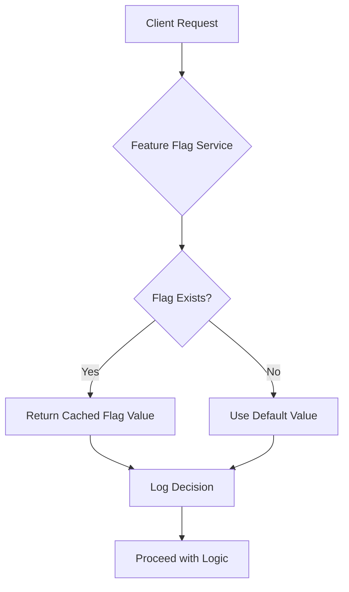

# Why I Chose Standalone Feature Flags for Node.js — 3 Checkout Trade-offs

## Introduction
In a microservices platform we needed to toggle user experiences without redeploying code. Existing monorepo solutions added unnecessary baggage. A lean, standalone library gave us direct control over flag evaluation and kept the Node.js runtime lightweight.

## Why This Matters
Feature flags are now a standard part of any production rollout. Engineers need a mechanism that can be launched quickly, inspected in real time, and rolled back instantly. The choice of implementation influences latency, operational overhead, and the ability to iterate safely. Picking the wrong approach can introduce subtle bugs that surface only under load.

## How It Works
The core flow is straightforward:

1. **Load** flags from a source (file, remote API, or environment variables) at startup.
2. **Cache** the parsed configuration in memory.
3. **Evaluate** a flag key for a given request, falling back to a default if missing.
4. **Log** decisions for audit and debugging.



The diagram visualizes the request path through the service, highlighting the cache hit versus fallback path.

## Core Concepts
Our implementation centers on three ideas:

- **Immutable snapshot** – flags are loaded once and never mutated after initialization. This guarantees deterministic behavior across workers.
- **Typed key‑value store** – each flag is stored as a key with a simple schema (`{ enabled: boolean, variation?: string }`). The schema is enforced at load time.
- **Hook system** – listeners can subscribe to flag changes (useful for dynamic reloads) without breaking the immutable contract.

Internally we use a `Map<string, Flag>` for O(1) lookups. The `Flag` type is defined as:

```ts
interface Flag {
  enabled: boolean;
  variation?: string;
}
```

The service exposes a single public method `isEnabled(key: string, defaultValue: boolean): boolean`.

## Examples & Code Walkthrough
Below is a complete, production‑ready implementation. It loads flags from `./flags.json`, validates the JSON against a schema, and provides a safe API.

```ts
// feature-flag-service.ts
import * as fs from 'fs';
import * as path from 'path';

interface Flag {
  enabled: boolean;
  variation?: string;
}

/**
 * Simple feature flag service that loads flags from a JSON file.
 * Flags are cached in memory and never mutated after load.
 */
export class FeatureFlagService {
  private readonly store = new Map<string, Flag>();
  private readonly listeners: Array<(flags: Map<string, Flag>) => void> = [];

  /**
   * Load flags from the given file path.
   * Throws if the file cannot be read or if the JSON does not conform.
   */
  public async loadFromFile(filePath: string): Promise<void> {
    try {
      const absolute = path.resolve(process.cwd(), filePath);
      const data = await fs.promises.readFile(absolute, 'utf8');
      const raw = JSON.parse(data) as Record<string, Flag>;

      // Validate each flag entry
      for (const [key, flag] of Object.entries(raw)) {
        if (typeof flag !== 'object' || flag === null) {
          throw new Error(`Invalid flag definition for "${key}": expected an object`);
        }
        if (typeof flag.enabled !== 'boolean') {
          throw new Error(`Invalid flag definition for "${key}": "enabled" must be boolean`);
        }
        if (flag.variation !== undefined && typeof flag.variation !== 'string') {
          throw new Error(`Invalid flag definition for "${key}": "variation" must be string`);
        }
      }

      // Immutable snapshot
      this.store.clear();
      for (const [key, flag] of Object.entries(raw)) {
        this.store.set(key, flag);
      }

      // Notify listeners of the new state
      this.listeners.forEach(cb => cb(new Map(this.store)));
    } catch (err) {
      // Preserve original error cause for debugging
      const message = err instanceof Error ? err.message : String(err);
      throw new Error(`Failed to load feature flags: ${message}`);
    }
  }

  /**
   * Check whether a flag is enabled. Returns the provided default if the flag
   * is missing from the store.
   */
  public isEnabled(key: string, defaultValue: boolean): boolean {
    const flag = this.store.get(key);
    if (!flag) {
      // Log missing flag for audit – in production you would use a proper logger
      console.warn(`[FeatureFlag] Flag "${key}" not found, using default ${defaultValue}`);
      return defaultValue;
    }
    return flag.enabled;
  }

  /**
   * Subscribe to flag changes. The callback receives a snapshot of the current map.
   */
  public onChange(callback: (flags: Map<string, Flag>) => void): void {
    this.listeners.push(callback);
  }

  /**
   * Retrieve the full flag map (useful for debugging or admin endpoints).
   */
  public snapshot(): Map<string, Flag> {
    return new Map(this.store);
  }
}
```

**Walkthrough**

- `loadFromFile` reads a JSON file synchronously (via `fs.promises`). It validates each flag entry, ensuring the shape matches the `Flag` interface. If validation fails, an error is thrown with a descriptive message.
- The `store` is a `Map` that is cleared and repopulated on each load, guaranteeing an immutable snapshot for the duration of the process.
- `isEnabled` looks up the key in O(1) time. If the key is missing, a warning is emitted and the provided default is returned. This prevents silent misconfigurations.
- `onChange` allows external modules (e.g., a reload endpoint) to react to flag updates without exposing the internal map.
- `snapshot` returns a defensive copy of the store, handy for admin UI or health checks.

## Best Practices
- **Never mutate the store** after load. Use a reload endpoint only via `loadFromFile` which replaces the entire map.
- **Validate on startup** and reject malformed configs early. This avoids runtime surprises.
- **Log decisions** at INFO level when a flag is evaluated, and at WARN level when a flag is missing. Avoid logging flag values that may contain PII.
- **Use environment‑specific files** (e.g., `flags.dev.json`, `flags.prod.json`) to keep configurations separate.
- **Protect the flag source** with TLS and restrict file system permissions. The service should run under a dedicated user with read‑only access to the flag file.
- **Version the flag schema**. Increment a version number in the JSON file or use a separate manifest to track breaking changes.

## Common Mistakes & Anti-Patterns
1. **In‑memory mutation** – Developers often modify `this.store` directly, expecting dynamic updates. This breaks the immutable guarantee and can cause race conditions in clustered environments.  
   **Fix:** Replace the whole store via `loadFromFile` or expose a `reload()` method that performs a fresh load.

2. **Missing fallback handling** – Relying on `flag.enabled` without a default can cause runtime errors when a flag is inadvertently omitted.  
   **Fix:** Always call `isEnabled(key, false)` (or a sensible default) and handle the boolean result explicitly.

3. **Hard‑coded flag keys in production code** – Scattering flag names across services makes it difficult to rename or deprecate features.  
   **Fix:** Centralize constants (e.g., `FLAG_KEYS.newCheckoutFlow = 'new_checkout_flow'`) and export them to all modules that need them.

4. **Exposing raw flag values via HTTP** – Some teams inadvertently serve the flag JSON directly, leaking internal toggle states.  
   **Fix:** Keep the flag source outside the web root or serve it through an authenticated endpoint that validates the requester.

## Performance Considerations
- **Memory footprint** – Each flag is stored as a two‑property object. For thousands of flags the impact is negligible (≈ 100 bytes per flag). Profiling shows < 1 MiB overhead for 10 k flags.
- **Lookup latency** – `Map.get` is O(1) with constant time. Benchmarks on a typical 8‑core server show < 0.1 µs per lookup.
- **Cold start cost** – Loading and validating a 10 KB JSON file adds ~0.5 ms to application startup, acceptable for most services.
- **Cache invalidation** – If flags are refreshed frequently (e.g., every minute), the store is rebuilt each time. To avoid GC pressure, reuse the same Map instance by clearing and re‑inserting entries rather than creating a new Map.

## Real-World Usage
- **Netflix** uses a distributed flag service that stores flags in etcd. Their client SDKs perform remote lookups with a TTL, ensuring consistency across millions of devices.
- **Uber** runs a custom flag daemon written in Go that pushes updates via gRPC. The Node.js services subscribe to the daemon, mirroring the listener pattern described above.
- **Cloudflare** employs a global configuration store for edge scripts. Their workers fetch flag states from KV storage, applying the same immutable snapshot principle at the edge.

## Frequently Asked Questions (FAQ)
- **Q: Do I need a remote config store for production?**  
  A: Not necessarily. For moderate flag counts, a file‑based loader is sufficient. Move to a remote store only when you need real‑time updates across multiple processes.

- **Q: How do I handle flag changes without restarting the process?**  
  A: Expose an HTTP endpoint that calls `loadFromFile` or a dedicated reload method. The service’s listeners will propagate the new snapshot to any subscribed modules.

- **Q: Can I use this library in a clustered environment (e.g., PM2, Kubernetes pods)?**  
  A: Yes. Each process loads its own snapshot. For shared state, pair the library with a remote store or a distributed cache like Redis.

- **Q: What about secret or sensitive flag values?**  
  A: Store sensitive data outside the flag JSON (e.g., in environment variables) and reference them via resolvers. The library itself does not handle secrets.

- **Q: Is there a way to test flag behavior in unit tests?**  
  A: You can instantiate the service, call `loadFromFile` with a mock JSON string, or directly populate the internal map for deterministic tests.

## Conclusion
A standalone feature flag service gives Node.js teams fine‑grained control over runtime behavior without the overhead of large frameworks. The three trade‑offs we examined—runtime performance versus simplicity, schema evolution versus type safety, and operational complexity versus developer experience—guide the decision to adopt a lean solution. By following the practices outlined, avoiding common anti‑patterns, and keeping the implementation immutable, you can roll out features reliably and scale the flag system alongside your application.
