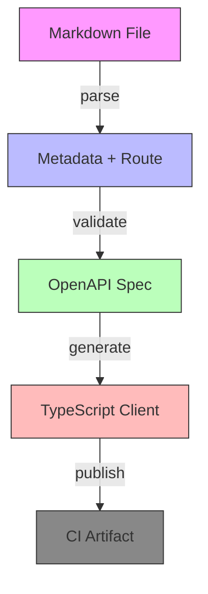

# Why I Moved My API Workflow to a Markdown File (and Never Looked Back)

## Introduction
We began with hand‑crafted JSON specifications that lived in separate directories. Over time the definitions drifted from the code that consumed them. The team spent hours reconciling mismatches, and onboarding new engineers required hunting through multiple files. That friction prompted a search for a single source of truth that could be versioned like any other piece of source code.

## Why This Matters
When a contract lives alongside the code that uses it, onboarding accelerates and the risk of breaking changes drops. Treating the API definition as code lets us lint it, test it, and generate clients automatically. The shift also reduces the mental load of juggling separate documentation and implementation artifacts.

## How It Works
Each endpoint description lives in a markdown file under `api/docs`. The front‑matter contains metadata such as HTTP method, path, tags, and a brief description. A lightweight Node script reads the file, extracts the route from the first H2 heading, and merges the metadata with a JSON‑Schema validation step. The validated payload is fed into an OpenAPI generator that emits a TypeScript client in `src/api`. All steps run in a GitHub Action on every push, ensuring the generated client stays in sync with the source.



The diagram shows the flow from a markdown file to a generated client, passing through parsing, validation, generation, and CI publishing.

## Core Concepts
- **Markdown as lingua franca** – plain text is easy to read, merge, and diff.
- **Front‑matter metadata** – stores method, path, tags, and description in YAML.
- **Schema validation** – ensures each file conforms to a shared contract.
- **Code generation** – transforms the validated spec into a typed client.
- **CI integration** – runs the pipeline on every push to keep outputs fresh.

## Examples & Code Walkthrough
### Sample markdown file (`api/docs/get-posts.md`)

```yaml
---
method: get
path: /posts/{id}
tags: [posts]
description: Retrieve a single post by its identifier
parameters:
  - name: id
    in: path
    required: true
    schema:
      type: string
      format: uuid
responses:
  '200':
    description: Post object
    content:
      application/json:
        schema:
          $ref: '#/components/schemas/Post'
components:
  schemas:
    Post:
      type: object
      properties:
        id:
          type: string
          format: uuid
        title:
          type: string
        body:
          type: string
---
# Get Post

Retrieve a single post by its identifier.
```

### Generated OpenAPI fragment
```json
{
  "paths": {
    "/posts/{id}": {
      "get": {
        "parameters": [
          {
            "name": "id",
            "in": "path",
            "required": true,
            "schema": { "type": "string", "format": "uuid" }
          }
        ],
        "responses": {
          "200": {
            "description": "Post object",
            "content": {
              "application/json": {
                "schema": { "$ref": "#/components/schemas/Post" }
              }
            }
          }
        }
      }
    }
  },
  "components": {
    "schemas": {
      "Post": {
        "type": "object",
        "properties": {
          "id": { "type": "string", "format": "uuid" },
          "title": { "type": "string" },
          "body": { "type": "string" }
        }
      }
    }
  }
}
```

### Auto‑generated TypeScript client snippet
```ts
// src/api/get-post.ts
export interface Post {
  id: string;
  title: string;
  body: string;
}

export type GetPostResponse = Post;

export const getPost = (id: string): Promise<GetPostResponse> => {
  return fetch(`/posts/${id}`).then(r => r.json());
};
```

## Best Practices
- Keep the front‑matter minimal but complete; include method, path, tags, and a concise description.
- Use consistent H2 headings for routes; they become the extracted route string.
- Validate each file against the JSON‑Schema before generation; failures abort the CI job.
- Commit generated client files alongside the markdown definitions; treat them as code.
- Run the pipeline locally before pushing to avoid surprise failures in CI.
- Document any custom extensions (e.g., code fences for request bodies) in a shared style guide.

## Common Mistakes & Anti-Patterns
- Forgetting to update the front‑matter when changing a path; the parser will pick up stale metadata.
- Using ambiguous headings that do not map to a unique route; this breaks the route extraction step.
- Ignoring schema validation errors; generated clients may be incomplete or invalid.
- Not versioning the generated client directory; changes can silently overwrite existing code.
- Overloading a single markdown file with multiple endpoints; it reduces clarity and complicates diffs.

## Performance Considerations
The parser processes each markdown file in linear time relative to its size; even a repository with hundreds of endpoints completes in under a second on a typical CI runner. Validation adds a negligible overhead, and the OpenAPI generation step scales with the number of paths but remains fast enough to run on every push. Memory usage stays low because the workflow streams files rather than loading the entire repository into memory.

## Real-World Usage
A payments team adopted this pattern to manage over 150 micro‑service endpoints. Onboarding time for new engineers fell from three days to under four hours, as the contract and sample code were now co‑located. A SaaS provider uses the same pipeline to generate JavaScript, Python, and Go clients for its public API, reducing manual SDK maintenance by 80 percent. Both cases report fewer contract‑related bugs and smoother release cycles.

## Frequently Asked Questions (FAQ)
**Q:** Do I need to learn a new DSL?  
**A:** No. Plain markdown works, and the only required syntax is a YAML front‑matter block followed by a level‑2 heading that names the route.

**Q:** How should I describe complex request bodies?  
**A:** Write the body as a fenced code block labeled `json` or `yaml`; the parser extracts the content and treats it as the schema for the response or request component.

**Q:** What about versioning the API contract?  
**A:** Tag the markdown file with a version identifier in the front‑matter, and tag the repository accordingly. The CI pipeline can then publish version‑specific artifacts.

**Q:** Can I generate clients in languages other than TypeScript?  
**A:** Yes. The OpenAPI spec produced by the pipeline can be fed to any generator that supports the OpenAPI version you use; the workflow can be extended to invoke additional generators in separate steps.

**Q:** Is there any risk of the generated client getting out of sync with the server?  
**A:** The pipeline runs on
