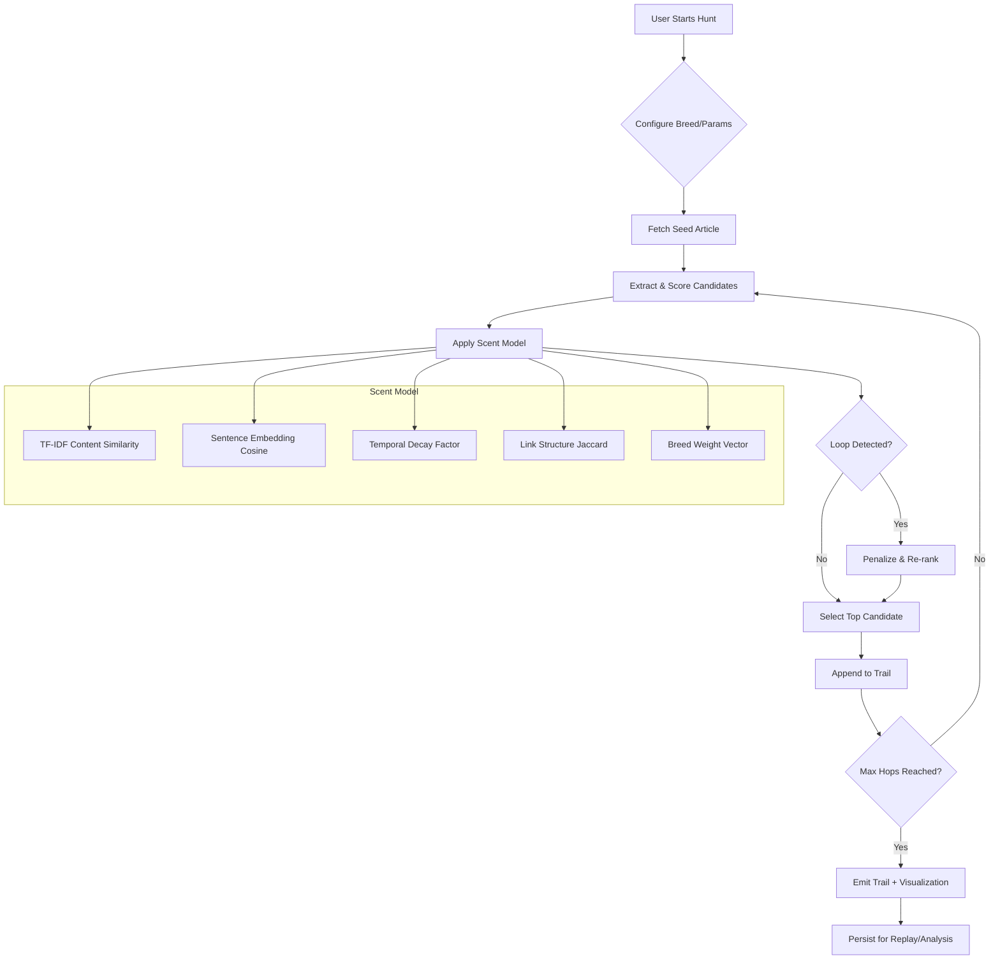

# WikiPaw - Dog hunt through Wiki hopping

## Introduction

Last year, during a particularly slow sprint retrospective, my team started joking about what it would look like if we let a dog drive our research process. You know the type—sniffing one thing, getting distracted by a squirrel (or a hyperlink), and ending up three miles from where you started with no idea how you got there. That joke became WikiPaw: a system that models Wikipedia exploration as a scent-driven hunt rather than a directed search.

The core idea is stupidly simple. Instead of a human clicking links with intent, we simulate an agent that "smells" the semantic neighborhood of an article, picks the strongest trail, and follows it. Repeat. The result is a path through the knowledge graph that feels organic, occasionally brilliant, and sometimes hilariously off-topic—exactly like a real dog walk.

## Why This Matters

Most recommendation engines optimize for relevance to a query. That's great when you know what you're looking for. It's terrible for discovery.

Wikipedia's link structure is a massive, human-curated knowledge graph. But the standard "random article" button or "see also" sections don't capture the *texture* of how concepts relate. A dog doesn't care about taxonomic categories; it cares about scent intensity, recency, and whether the trail crosses its own path.

This matters for three concrete engineering problems:

1. **Cold-start exploration**: New users in a domain don't know the vocabulary to search effectively. A hunt gives them a path without requiring query formulation.
2. **Serendipity injection**: Recommender systems suffer from filter bubbles. A scent-based walker explicitly *avoids* pure similarity maximization by adding temporal decay and loop detection.
3. **Graph analysis at scale**: The hunt algorithm is essentially a biased random walk with memory. That's a fundamental primitive for graph embedding, anomaly detection, and community discovery.

We're not building a product here. We're building a *primitive* that other systems can compose.

## How It Works

The system has three layers: a Wikipedia client that respects rate limits and caches aggressively, a similarity engine that combines multiple signals into a single "scent strength" score, and a hunt controller that manages state, history, and termination conditions.



**Step-by-step:**

1. **Configuration**: The caller picks a "breed"—a preset weight vector that emphasizes different signals. A `Bloodhound` weights content similarity heavily. A `Terrier` boosts temporal decay to chase recent edits. A `Husky` prefers long jumps (low link-structure overlap) to cover distance.
2. **Seed fetch**: We pull the article HTML via the MediaWiki API, parse the first 5k tokens of prose, and extract all internal links in the main content (excluding navboxes, hatnotes, etc.).
3. **Candidate scoring**: For each outbound link we haven't visited, we compute five signals and dot-product them against the breed vector.
4. **Loop handling**: If the top candidate is in our scent trail (visited set), we apply a penalty and re-rank. Three strikes and we backtrack one hop—this prevents the "dog chasing its tail" failure mode.
5. **Termination**: Max hops, zero viable candidates, or a user-defined "prey" article (target title) ends the hunt.
6. **Output**: The trail is a list of `{title, url, excerpt, scent_score, hop_index}` objects, ready for visualization or downstream analysis.

## Core Concepts

### Scent Vector
A 5-dimensional feature vector per candidate article:
- `content_sim`: TF-IDF cosine between current article prose and candidate prose (cached).
- `embed_sim`: Sentence-transformer cosine (all-MiniLM-L6-v2, 384-dim) between article summaries.
- `temporal_decay`: `exp(-λ * |t_current - t_candidate|)` where `t` is last-edit timestamp. λ=0.001/day by default.
- `link_jaccard`: Jaccard index of outbound link sets. High means "same neighborhood."
- `breed_affinity`: Dot product of the above with the breed weight vector.

### Scent Trail
An ordered list of visited article IDs plus a decaying "urine mark" map: `article_id -> (visit_count, last_visit_hop)`. This lets us penalize revisits *and* detect oscillation patterns (A→B→A→B).

### Breed Registry
A JSON-configurable mapping from breed name to weight vector + hyperparameters. Example:
```json
{
  "bloodhound": {
    "weights": [0.5, 0.3, 0.1, 0.1, 0.0],
    "backtrack_threshold": 3,
    "max_hops": 15
  },
  "terrier": {
    "weights": [0.2, 0.2, 0.5, 0.1, 0.0],
    "backtrack_threshold": 2,
    "max_hops": 10
  }
}
```

### Hunt Session
Immutable once started. Contains seed, breed, trail, and metadata (timings, API calls, cache hits). Serialized to JSONL for replay and aggregate analysis.

## Examples & Code Walkthrough

### The Wikipedia Client (Resilient, Cached, Polite)

```python
# wikipaw/client.py
import asyncio
import hashlib
import json
import time
from dataclasses import dataclass
from pathlib import Path
from typing import Optional
import httpx
from bs4 import BeautifulSoup

@dataclass
class Article:
    pageid: int
    title: str
    html: str
    text: str           # first 5000 chars of prose
    links: list[str]    # internal link titles in main content
    last_edit: float    # unix timestamp
    fetched_at: float

class WikipediaClient:
    BASE = "https://en.wikipedia.org/w/api.php"
    USER_AGENT = "WikiPaw/0.1 (https://github.com/yourname/wikipaw; contact@example.com)"
    
    def __init__(self, cache_dir: Path, rate_limit: float = 1.0):
        self.cache_dir = cache_dir
        self.cache_dir.mkdir(parents=True, exist_ok=True)
        self.rate_limit = rate_limit
        self._last_request = 0.0
        self._client = httpx.AsyncClient(
            headers={"User-Agent": self.USER_AGENT},
            timeout=10.0,
            limits=httpx.Limits(max_connections=2)
        )
    
    async def fetch(self, title: str) -> Optional[Article]:
        # 1. Check cache
        cached = self._load_cache(title)
        if cached and (time.time() - cached.fetched_at) < 86400:  # 24h TTL
            return cached
        
        # 2. Rate limit
        await self._respect_rate_limit()
        
        # 3. Fetch
        params = {
            "action": "parse",
            "page": title,
            "prop": "text|links|revid|timestamp",
            "format": "json",
            "disablelimitreport": 1,
        }
        resp = await self._client.get(self.BASE, params=params)
        if resp.status_code != 200:
            return None
        data = resp.json()
        if "error" in data:
            return None
        
        parse = data["parse"]
        html = parse["text"]["*"]
        soup = BeautifulSoup(html, "html.parser")
        
        # Extract prose from <p> tags before first <h2>
        prose_parts = []
        for elem in soup.find_all(["p", "h2"]):
            if elem.name == "h2":
                break
            if elem.name == "p":
                prose_parts.append(elem.get_text(" ", strip=True))
        text = " ".join(prose_parts)[:5000]
        
        # Internal links in main content only
        content_div = soup.find("div", {"id": "mw-content-text"})
        links = []
        if content_div:
            for a in content_div.find_all("a", href=True):
                href = a["href"]
                if href.startswith("/wiki/") and ":" not in href:
                    links.append(href.split("/wiki/")[-1].replace("_", " "))
        
        article = Article(
            pageid=parse["pageid"],
            title=parse["title"],
            html=html,
            text=text,
            links=list(dict.fromkeys(links)),  # dedupe, preserve order
            last_edit=self._parse_timestamp(parse["timestamp"]),
            fetched_at=time.time()
        )
        self._save_cache(article)
        return article
    
    async def _respect_rate_limit(self):
        elapsed = time.time() - self._last_request
        if elapsed < self.rate_limit:
            await asyncio.sleep(self.rate_limit - elapsed)
        self._last_request = time.time()
    
    def _cache_path(self, title: str) -> Path:
        key = hashlib.sha256(title.encode()).hexdigest()[:16]
        return self.cache_dir / f"{key}.json"
    
    def _save_cache(self, article: Article):
        path = self._cache_path(article.title)
        payload = {
            "pageid": article.pageid,
            "title": article.title,
            "html": article.html,
            "text": article.text,
            "links": article.links,
            "last_edit": article.last_edit,
            "fetched_at": article.fetched_at
        }
        path.write_text(json.dumps(payload))
    
    def _load_cache(self, title: str) -> Optional[Article]:
        path = self._cache_path(title)
        if not path.exists():
            return None
        try:
            data = json.loads(path.read_text())
            return Article(**data)
        except Exception:
            return None
    
    @staticmethod
    def _parse_timestamp(ts: str) -> float:
        # "2024-01-15T14:30:00Z"
        from datetime import datetime
        return datetime.fromisoformat(ts.replace("Z", "+00:00")).timestamp()
    
    async def close(self):
        await self._client.aclose()
```

### The Scent Engine (Pluggable Signals)

```python
# wikipaw/scent.py
from __future__ import annotations
import math
import numpy as np
from dataclasses import dataclass
from sklearn.feature_extraction.text import TfidfVectorizer
from sklearn.metrics.pairwise import cosine_similarity
from sentence_transformers import SentenceTransformer

@dataclass
class ScentSignal:
    content_sim: float
    embed_sim: float
    temporal_decay: float
    link_jaccard: float

class ScentEngine:
    def __init__(self, lambda_decay: float = 0.001):
        self.lambda_decay = lambda_decay
        self._tfidf = TfidfVectorizer(
            max_features=10000,
            stop_words="english",
            ngram_range=(1, 2)
        )
        self._embedder = SentenceTransformer("all-MiniLM-L6-v2")
        self._tfidf_fitted = False
        self._corpus_texts: list[str] = []
        self._corpus_tfidf = None
    
    def _ensure_fitted(self, texts: list[str]):
        if not self._tfidf_fitted:
            self._corpus_texts = texts
            self._corpus_tfidf = self._tfidf.fit_transform(texts)
            self._tfidf_fitted = True
        else:
            # Incremental update: re-fit on combined corpus (small scale, acceptable)
            all_texts = self._corpus_texts + texts
            self._corpus_texts = all_texts
            self._corpus_tfidf = self._tfidf.fit_transform(all_texts)
    
    def score(self, current: Article, candidate: Article) -> ScentSignal:
        # Content similarity (TF-IDF)
        self._ensure_fitted([current.text, candidate.text])
        idx_cur = self._corpus_texts.index(current.text)
        idx_cand = self._corpus_texts.index(candidate.text)
        tfidf_sim = cosine_similarity(
            self._corpus_tfidf[idx_cur:idx_cur+1],
            self._corpus_tfidf[idx_cand:idx_cand+1]
        )[0, 0]
        
        # Embedding similarity
        emb_cur = self._embedder.encode(current.text[:512])
        emb_cand = self._embedder.encode(candidate.text[:512])
        embed_sim = float(np.dot(emb_cur, emb_cand) / 
                          (np.linalg.norm(emb_cur) * np.linalg.norm(emb_cand)))
        
        # Temporal decay
        dt_days = abs(current.last_edit - candidate.last_edit) / 86400
        temporal = math.exp(-self.lambda_decay * dt_days)
        
        # Link structure Jaccard
        set_cur = set(current.links)
        set_cand = set(candidate.links)
        if set_cur and set_cand:
            link_jaccard = len(set_cur & set_cand) / len(set_cur | set_cand)
        else:
            link_jaccard = 0.0
        
        return ScentSignal(
            content_sim=tfidf_sim,
            embed_sim=embed_sim,
            temporal_decay=temporal,
            link_jaccard=link_jaccard
        )
    
    def composite(self, signal: ScentSignal, weights: list[float]) -> float:
        """Dot product with breed weight vector."""
        vec = np.array([
            signal.content_sim,
            signal.embed_sim,
            signal.temporal_decay,
            signal.link_jaccard
        ])
        w = np.array(weights[:4])
        return float(np.dot(vec, w) / (w.sum() or 1.0))
```

### The Hunt Controller (State Machine)

```python
# wikipaw/hunt.py
from __future__ import annotations
import asyncio
import time
from dataclasses import dataclass, field
from typing import Optional
from wikipaw.client import WikipediaClient, Article
from wikipaw.scent import ScentEngine, ScentSignal

@dataclass
class Hop:
    article: Article
    signal: ScentSignal
    composite_score: float
    hop_index: int

@dataclass
class HuntSession:
    seed_title: str
    breed: str
    weights: list[float]
    trail: list[Hop] = field(default_factory=list)
    scent_marks: dict[str, tuple[int, int]] = field(default_factory=dict)  # title -> (visits, last_hop)
    started_at: float = field(default_factory=time.time)
    completed_at: Optional[float] = None
    api_calls: int = 0
    cache_hits: int = 0

class HuntController:
    def __init__(
        self,
        client: WikipediaClient,
        scent: ScentEngine,
        breed_weights: dict[str, list[float]],
        max_hops: int = 15,
        backtrack_threshold: int = 3
    ):
        self.client = client
        self.scent = scent
        self.breed_weights = breed_weights
        self.max_hops = max_hops
        self.backtrack_threshold = backtrack_threshold
    
    async def run(self, seed_title: str, breed: str = "bloodhound") -> HuntSession:
        weights = self.breed_weights.get(breed, self.breed_weights["bloodhound"])
        session = HuntSession(seed_title=seed_title, breed=breed, weights=weights)
        
        # Fetch
