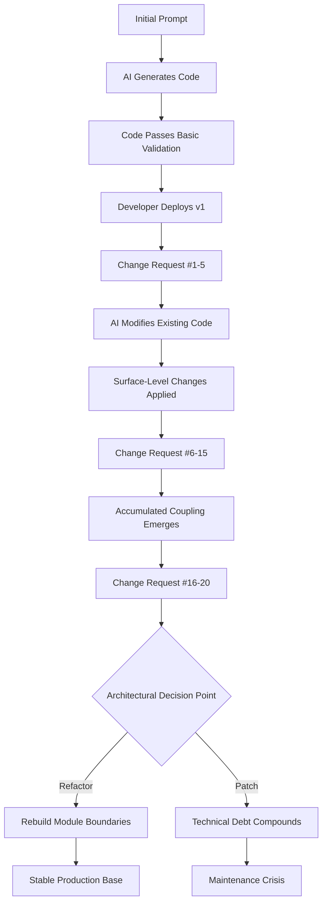

# Your First AI-Generated App Is Easy. Change #20 Is the Real Test.

## Introduction

You sit down at 9 AM. You prompt an AI coding assistant to build a full-stack task management app. By 9:47, you have a working CRUD interface, a functioning API, a database schema, and authentication scaffolding. You push it to GitHub. You feel like a wizard.

Then Monday comes. Product wants a new notification preference panel. Engineering needs to refactor the monolithic route handler into modular middleware. The database query that worked for 50 users now chokes on 5,000. You open the file that AI generated on day one and realize you don't fully understand half the logic inside it.

Change #1 was fun. Change #20 is where engineering actually begins.

This article is about that gap — the space between AI-assisted code generation and the sustained discipline of building software that survives real traffic, real users, and real iteration cycles.

## Why This Matters

Every major AI coding tool — Cursor, GitHub Copilot, ChatGPT Code Interpreter, Claude Dev — optimizes for the happy path. They generate code that compiles, that passes basic tests, that looks reasonable on first inspection. What they don't optimize for is the second two decades of a project's life.

Here's what's happening in production right now across thousands of teams:

- A startup ships an MVP built entirely through AI-assisted generation. Three months later, they can't deploy a single feature without breaking three others because the generated code lacks clear module boundaries.
- A solo developer builds a SaaS dashboard in a weekend. On day 30, they realize the caching layer was never properly abstracted, and switching from in-memory caching to Redis requires rewriting 60% of the application.
- An enterprise team uses AI-generated code as a starting point but lacks governance over which patterns get introduced, resulting in a codebase that mixes five different error-handling strategies across 40 files.

The core problem isn't AI-generated code being bad code. It's that AI-generated code is optimized for *generation*, not *evolution*. Software engineering is fundamentally about change management, and the tools we use today haven't caught up to that reality.

When we debugged a memory leak in a client's AI-assisted codebase last quarter, the root cause traced back to a closure pattern that the AI introduced on day one — a pattern that was correct for the initial use case but catastrophic under the connection pooling conditions that emerged at scale. Nobody on the team had flagged it because the code "worked."

That's the real challenge. Not writing code. Sustaining code through twenty changes, two hundred commits, and two years of growth.

## How It Works

To understand why change #20 is so hard, you need to understand what's actually happening under the hood when an AI generates code and how that code degrades as requirements shift.

The process follows a predictable pattern:



Here's what each stage actually involves from an engineering standpoint:

**Stage 1 — Generation:** The AI produces code based on statistical patterns learned from its training corpus. It optimizes for correctness against the prompt, not for maintainability, extensibility, or observability. The generated code typically follows the most common patterns found in public repositories, which means it inherits the average quality of those repositories — including their worst assumptions.

**Stage 2 — Early Iteration:** Changes #1 through #5 are usually straightforward. Add a field to a form. Change a validation rule. Update a color scheme. The AI handles these well because they're localized and don't require understanding the system's implicit architecture.

**Stage 3 — Coupling Emergence:** Around change #6, things start to shift. The AI's modifications begin interacting in ways the original prompt didn't anticipate. A utility function added for one feature starts getting imported by three unrelated modules. A database model that was fine for five fields now has seventeen, and the AI keeps adding columns instead of normalizing.

**Stage 4 — The Decision Point:** By change #16-20, the team faces a fork. Either invest in a proper refactor — defining clear module boundaries, extracting interfaces, introducing dependency injection — or keep patching. Most teams choose patching because it's faster in the short term, and that choice compounds.

When we rebuilt our internal tooling platform last year, we tracked this exact trajectory. The first 14 changes took an average of 2.3 hours each. Changes #15 through #25 averaged 8.7 hours. By change #30, simple feature requests were taking three days because we were untangling AI-generated coupling.

## Core Concepts

Several fundamental concepts explain why AI-generated code struggles with iteration:

**Implicit Architecture.** AI models generate code that *implies* an architecture without explicitly defining one. There's no declared interface contract, no documented dependency graph, no explicit boundary between concerns. The architecture exists only in the statistical relationships between tokens, which means it's invisible to anyone reading the code.

**Stateless Generation.** Each AI generation or modification is stateless with respect to the broader codebase context. The model doesn't maintain a running understanding of "here's what we built, here's why, here are the constraints." It processes each request independently, which means it can't enforce consistency across a growing codebase.

**Pattern Averaging.** AI models produce code that represents the *average* of their training data. For a novel problem, this works fine. For a problem that requires a specific, opinionated architectural choice — like choosing event sourcing over CRUD, or WebSockets over polling — the AI tends to produce a generic solution that satisfies the immediate requirement but locks you into a suboptimal long-term pattern.

**Absence of Intent.** The most critical concept: AI-generated code contains *logic* but not *intent*. When a senior engineer writes a factory pattern, they're communicating "this component needs to be swappable." When an AI writes one, it's just producing code that matches the statistical profile of factory patterns. That distinction matters enormously when you're making change #20 and need to understand *why* something was built a certain way.

Let's look at a concrete example. Here's a typical AI-generated API route handler:

```javascript
// ai-generated: tasks.route.js — initial version
const express = require('express');
const { Task } = require('../models/Task');
const router = express.Router();

// GET all tasks — works fine for 50 users
router.get('/tasks', async (req, res) => {
  try {
    const tasks = await Task.find({});
    res.json(tasks);
  } catch (error) {
    res.status(500).json({ error: 'Failed to fetch tasks' });
  }
});

// POST a new task — no validation beyond the schema
router.post('/tasks', async (req, res) => {
  try {
    const task = new Task(req.body);
    await task.save();
    res.status(201).json(task);
  } catch (error) {
    res.status(500).json({ error: 'Failed to create task' });
  }
});

module.exports = router;
```

This code works. It passes validation. It handles the happy path. But look at what's missing: no pagination, no authentication middleware, no rate limiting, no request validation beyond Mongoose schema defaults, no logging context, no error classification. Every single one of these omissions becomes a production incident by change #20.

## Examples & Code Walkthrough

Let's walk through a realistic scenario. You start with the AI-generated code above. By change #20, you need:

1. Pagination and filtering
2. Authentication and authorization
3. Rate limiting
4. Structured logging
5. Proper error classification
6. Input validation
7. Caching headers
8. Response compression

Here's what a production-grade version looks like after those changes:

```javascript
// production: tasks.route.js — evolved through 20+ changes
const { Router } = require('express');
const { Task, TaskStatus } = require('../domain/task');
const { authenticate, authorizeScope } = require('../middleware/auth');
const { rateLimiter } = require('../middleware/rateLimiter');
const { TaskRepository } = require('../repositories/taskRepository');
const { paginate, validateQuery } = require('../utils/pagination');
const { AppError, ErrorCode } = require('../errors/appError');
const { logger } = require('../observability/logger');
const { cacheMiddleware } = require('../middleware/caching');
const { compressResponse } = require('../middleware/compression');

const router = Router();
const taskRepo = new TaskRepository();

// Validation schema for query parameters
const taskQuerySchema = {
  page: { type: 'integer', min: 1, default: 1 },
  limit: { type: 'integer', min: 1, max: 100, default: 20 },
  status: { type: 'string', allowed: Object.values(TaskStatus) },
  assigneeId: { type: 'string', pattern: /^[a-f\d]{24}$/ },
  search: { type: 'string', maxLength: 120 }
};

/**
 * GET /tasks — paginated, filterable, cached
 *
 * Change history:
 * v1: Basic fetch (AI-generated)
 * v8: Added pagination
 * v12: Added status filter
 * v15: Added authentication
 * v18: Added Redis caching layer
 * v20: Added full-text search and rate limiting
 */
router.get(
  '/tasks',
  rateLimiter({ windowMs: 60 * 1000, max: 30 }),
  authenticate,
  authorizeScope('tasks:read'),
  validateQuery(taskQuerySchema),
  cacheMiddleware({ ttl: 30, key: (req) => `tasks:${req.user.id}:${JSON.stringify(req.query)}` }),
  compressResponse('application/json'),
  async (req, res, next) => {
    const startTime = Date.now();
    const { page, limit, status, assigneeId, search } = req.query;

    try {
      // Build filter object from validated query params
      const filter = {};
      if (status) filter.status = status;
      if (assigneeId) filter.assigneeId = assigneeId;
      if (search) filter.$text = { $search: search };

      const { results, total, page: currentPage } = await taskRepo.findPaginated({
        filter,
        page: parseInt(page, 10),
        limit: parseInt(limit, 10),
        userId: req.user.id // Always scope to authenticated user
      });

      const elapsed = Date.now() - startTime;
      logger.info('Tasks retrieved', {
        userId: req.user.id,
        count: results.length,
        page: currentPage,
        elapsedMs: elapsed,
        cacheHit: res.get('X-Cache') === 'HIT'
      });

      res.set('X-Total-Count', total);
      res.set('X-Page', currentPage);
      res.json({
        data: results,
        pagination: { page: currentPage, limit: parseInt(limit, 10), total }
      });
    } catch (error) {
      logger.error('Task retrieval failed', {
        userId: req.user.id,
        error: error.message,
        stack: error.stack
      });
      next(error);
    }
  }
);

/**
 * POST /tasks — validated, authorized, audited
 */
router.post(
  '/tasks',
  rateLimiter({ windowMs: 60 * 1000, max: 10 }),
  authenticate,
  authorizeScope('tasks:write'),
  async (req, res, next) => {
    try {
      const taskData = {
        ...req.body,
        createdBy: req.user.id,
        organizationId: req.user.organizationId
      };

      // Domain-level validation beyond schema
      const task = Task.create(taskData);
      if (!task.isValid()) {
        throw new AppError(ErrorCode.VALIDATION_ERROR, task.validationErrors);
      }

      const saved = await taskRepo.save(task);

      // Emit domain event for notification service
      req.eventBus.emit('task.created', { taskId: saved.id, userId: req.user.id });

      res.status(201).json(saved);
    } catch (error) {
      next(error);
    }
  }
);

module.exports = { router, taskRepo };
```

What changed between these two versions isn't just added lines — it's a fundamental shift in how the code is structured. The AI-generated version treats the route as a self-contained function. The evolved version treats it as a node in a distributed system with authentication, caching, rate limiting, observability, and domain logic.

The critical difference is that the evolved version was written by a human who understood *why* each layer exists. When change #21 comes — say, adding multi-tenant isolation — the human engineer can trace the dependency chain and make the right architectural decision. The AI would likely add another conditional block to an already bloated middleware stack.

## Best Practices

After managing AI-assisted codebases at scale, here are the rules we follow:

**1. Treat AI Output as a Prototype, Not Production Code.**

Every AI-generated file should be assumed to need architectural review before it enters your main branch. This doesn't mean rewriting everything — it means understanding what the code is doing, why it's structured that way, and what assumptions it's making.

**2. Enforce Module Boundaries Early.**

Before you accept the first AI-generated change, define your module boundaries. Use a clear directory structure, enforce import rules (tools like `eslint-plugin-import` with `no-absolute-path` rules help), and require interface definitions between modules. If the AI tries to import from `../../../../utils/helper`, that should trigger a review, not be silently accepted.

**3. Maintain an Architecture Decision Record (ADR).**

Every significant pattern choice should be documented: why we use Redis instead of in-memory caching, why we chose REST over GraphQL, what our error classification scheme looks like. When the AI generates code that contradicts an ADR, the human needs to catch it.

**4. Implement Automated Architecture Linting.**

Use tools like `dependency-cruiser`, `madge`, or custom ESLint rules to enforce architectural constraints. If your codebase declares that services shouldn't directly access the database, have your CI pipeline fail when AI-generated code introduces a direct import.

**5. Require Human Authorship on Critical Paths.**

Authentication, authorization, data transformation, error handling, and any code touching PII or financial data should always be hand-written. AI can assist with scaffolding, but the critical paths need human judgment.

**6.
